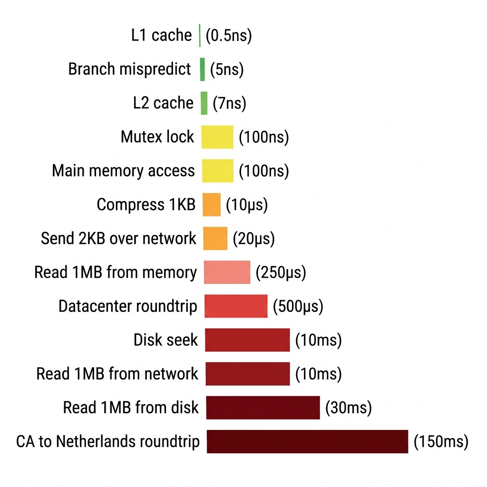

# Chapter 3: Back-of-the-envelope Estimation

> Source: [ByteByteGo - System Design Interview](https://bytebytego.com/courses/system-design-interview/back-of-the-envelope-estimation)

In a system design interview, sometimes you are asked to estimate system capacity or performance requirements using a back-of-the-envelope estimation. According to Jeff Dean, Google Senior Fellow, "back-of-the-envelope calculations are estimates you create using a combination of thought experiments and common performance numbers to get a good feel for which designs will meet your requirements" [1].

You need to have a good sense of scalability basics to effectively carry out back-of-the-envelope estimation. The following concepts should be well understood: power of two [2], latency numbers every programmer should know, and availability numbers.

---

## Power of two

Although data volume can become enormous when dealing with distributed systems, calculation all boils down to the basics. To obtain correct calculations, it is critical to know the data volume unit using the power of 2. A byte is a sequence of 8 bits. An ASCII character uses one byte of memory (8 bits). Below is a table explaining the data volume unit (Table 1).

| Power | Approximate value | Full name    | Short name |
|-------|-------------------|-------------|------------|
| 10    | 1 Thousand        | 1 Kilobyte  | 1 KB       |
| 20    | 1 Million         | 1 Megabyte  | 1 MB       |
| 30    | 1 Billion         | 1 Gigabyte  | 1 GB       |
| 40    | 1 Trillion        | 1 Terabyte  | 1 TB       |
| 50    | 1 Quadrillion     | 1 Petabyte  | 1 PB       |

*Table 1: Data volume unit using the power of 2.*

### Java Example – Data Volume Unit Conversion Utility

```java
public class DataVolumeConverter {

    public static final long KB = 1L << 10;  // 2^10 = 1,024
    public static final long MB = 1L << 20;  // 2^20 = 1,048,576
    public static final long GB = 1L << 30;  // 2^30 = 1,073,741,824
    public static final long TB = 1L << 40;  // 2^40
    public static final long PB = 1L << 50;  // 2^50

    public static String humanReadable(long bytes) {
        if (bytes >= PB) return String.format("%.2f PB", (double) bytes / PB);
        if (bytes >= TB) return String.format("%.2f TB", (double) bytes / TB);
        if (bytes >= GB) return String.format("%.2f GB", (double) bytes / GB);
        if (bytes >= MB) return String.format("%.2f MB", (double) bytes / MB);
        if (bytes >= KB) return String.format("%.2f KB", (double) bytes / KB);
        return bytes + " bytes";
    }

    public static void main(String[] args) {
        System.out.println("1 KB = " + KB + " bytes");
        System.out.println("1 MB = " + MB + " bytes");
        System.out.println("1 GB = " + GB + " bytes");
        System.out.println("1 TB = " + TB + " bytes");
        System.out.println("1 PB = " + PB + " bytes");

        long fileSize = 3_500_000_000L;
        System.out.println("\n" + fileSize + " bytes = " + humanReadable(fileSize));
        // Output: 3500000000 bytes = 3.26 GB
    }
}
```

---

## Latency numbers every programmer should know

Dr. Dean from Google reveals the length of typical computer operations in 2010 [1]. Some numbers are outdated as computers become faster and more powerful. However, those numbers should still be able to give us an idea of the fastness and slowness of different computer operations.

| Operation name                                  | Time                          |
|-------------------------------------------------|-------------------------------|
| L1 cache reference                              | 0.5 ns                       |
| Branch mispredict                               | 5 ns                         |
| L2 cache reference                              | 7 ns                         |
| Mutex lock/unlock                               | 100 ns                       |
| Main memory reference                           | 100 ns                       |
| Compress 1K bytes with Zippy                    | 10,000 ns = 10 µs            |
| Send 2K bytes over 1 Gbps network               | 20,000 ns = 20 µs            |
| Read 1 MB sequentially from memory              | 250,000 ns = 250 µs          |
| Round trip within the same datacenter           | 500,000 ns = 500 µs          |
| Disk seek                                       | 10,000,000 ns = 10 ms        |
| Read 1 MB sequentially from the network         | 10,000,000 ns = 10 ms        |
| Read 1 MB sequentially from disk                | 30,000,000 ns = 30 ms        |
| Send packet CA (California)->Netherlands->CA    | 150,000,000 ns = 150 ms      |

*Table 2: Latency numbers every programmer should know (Jeff Dean, 2010).*

**Notes:**

- ns = nanosecond, µs = microsecond, ms = millisecond
- 1 ns = 10^-9 seconds
- 1 µs = 10^-6 seconds = 1,000 ns
- 1 ms = 10^-3 seconds = 1,000 µs = 1,000,000 ns



*Figure 1: Visualization of latency numbers as of 2020 – colored squares proportional to operation duration.*

By analyzing the numbers in Figure 1, we get the following conclusions:

- Memory is fast but the disk is slow.
- Avoid disk seeks if possible.
- Simple compression algorithms are fast.
- Compress data before sending it over the internet if possible.
- Data centers are usually in different regions, and it takes time to send data between them.

### Java Example – Latency Reference Constants & Benchmarking

```java
import java.util.LinkedHashMap;
import java.util.Map;

public class LatencyReference {

    // Latency constants in nanoseconds
    public static final long L1_CACHE_REF         = 1;          // ~0.5 ns
    public static final long BRANCH_MISPREDICT     = 5;          // 5 ns
    public static final long L2_CACHE_REF          = 7;          // 7 ns
    public static final long MUTEX_LOCK_UNLOCK     = 100;        // 100 ns
    public static final long MAIN_MEMORY_REF       = 100;        // 100 ns
    public static final long COMPRESS_1KB_ZIPPY    = 10_000;     // 10 µs
    public static final long SEND_2KB_1GBPS        = 20_000;     // 20 µs
    public static final long READ_1MB_MEMORY       = 250_000;    // 250 µs
    public static final long DATACENTER_ROUNDTRIP  = 500_000;    // 500 µs
    public static final long DISK_SEEK             = 10_000_000; // 10 ms
    public static final long READ_1MB_NETWORK      = 10_000_000; // 10 ms
    public static final long READ_1MB_DISK         = 30_000_000; // 30 ms
    public static final long CA_TO_NETHERLANDS_RT  = 150_000_000;// 150 ms

    public static void main(String[] args) {
        Map<String, Long> latencies = new LinkedHashMap<>();
        latencies.put("L1 cache reference", L1_CACHE_REF);
        latencies.put("L2 cache reference", L2_CACHE_REF);
        latencies.put("Main memory reference", MAIN_MEMORY_REF);
        latencies.put("Compress 1KB (Zippy)", COMPRESS_1KB_ZIPPY);
        latencies.put("Read 1MB from memory", READ_1MB_MEMORY);
        latencies.put("Datacenter roundtrip", DATACENTER_ROUNDTRIP);
        latencies.put("Read 1MB from disk", READ_1MB_DISK);
        latencies.put("CA ↔ Netherlands roundtrip", CA_TO_NETHERLANDS_RT);

        System.out.println("=== Latency Numbers Every Programmer Should Know ===");
        for (Map.Entry<String, Long> entry : latencies.entrySet()) {
            System.out.printf("%-35s %,15d ns  (%s)%n",
                entry.getKey(), entry.getValue(), humanReadable(entry.getValue()));
        }
    }

    private static String humanReadable(long ns) {
        if (ns >= 1_000_000) return String.format("%.1f ms", ns / 1_000_000.0);
        if (ns >= 1_000)     return String.format("%.1f µs", ns / 1_000.0);
        return ns + " ns";
    }
}
```

---

## Availability numbers

High availability is the ability of a system to be continuously operational for a desirably long period of time. High availability is measured as a percentage, with 100% means a service that has 0 downtime. Most services fall between 99% and 100%.

A service level agreement (SLA) is a commonly used term for service providers. This is an agreement between you (the service provider) and your customer, and this agreement formally defines the level of uptime your service will deliver. Cloud providers Amazon [4], Google [5] and Microsoft [6] set their SLAs at 99.9% or above. Uptime is traditionally measured in nines. The more the nines, the better. As shown in Table 3, the number of nines correlate to the expected system downtime.

| Availability % | Downtime per day     | Downtime per week | Downtime per month | Downtime per year |
|----------------|----------------------|-------------------|--------------------|-------------------|
| 99%            | 14.40 minutes        | 1.68 hours        | 7.31 hours         | 3.65 days         |
| 99.9%          | 1.44 minutes         | 10.08 minutes     | 43.83 minutes      | 8.77 hours        |
| 99.99%         | 8.64 seconds         | 1.01 minutes      | 4.38 minutes       | 52.60 minutes     |
| 99.999%        | 864.00 milliseconds  | 6.05 seconds      | 26.30 seconds      | 5.26 minutes      |
| 99.9999%       | 86.40 milliseconds   | 604.80 ms         | 2.63 seconds       | 31.56 seconds     |

*Table 3: Availability SLA nines and corresponding downtime.*

### Java Example – Availability & Downtime Calculator

```java
public class AvailabilityCalculator {

    public static void main(String[] args) {
        double[] availabilities = {99.0, 99.9, 99.99, 99.999, 99.9999};

        System.out.println("=== SLA Availability & Downtime Calculator ===");
        System.out.printf("%-15s %-20s %-20s %-20s %-20s%n",
            "Availability %", "Downtime/Day", "Downtime/Week", "Downtime/Month", "Downtime/Year");
        System.out.println("-".repeat(95));

        for (double availability : availabilities) {
            double downtimeFraction = 1.0 - (availability / 100.0);

            double downtimePerDay   = downtimeFraction * 24 * 60 * 60;      // seconds
            double downtimePerWeek  = downtimeFraction * 7 * 24 * 60 * 60;  // seconds
            double downtimePerMonth = downtimeFraction * 30 * 24 * 60 * 60; // seconds
            double downtimePerYear  = downtimeFraction * 365 * 24 * 60 * 60;// seconds

            System.out.printf("%-15s %-20s %-20s %-20s %-20s%n",
                availability + "%",
                formatDuration(downtimePerDay),
                formatDuration(downtimePerWeek),
                formatDuration(downtimePerMonth),
                formatDuration(downtimePerYear));
        }
    }

    private static String formatDuration(double seconds) {
        if (seconds >= 86400)  return String.format("%.2f days", seconds / 86400);
        if (seconds >= 3600)   return String.format("%.2f hours", seconds / 3600);
        if (seconds >= 60)     return String.format("%.2f minutes", seconds / 60);
        if (seconds >= 1)      return String.format("%.2f seconds", seconds);
        return String.format("%.2f ms", seconds * 1000);
    }
}
```

---

## Example: Estimate Twitter QPS and storage requirements

Please note the following numbers are for this exercise only as they are not real numbers from Twitter.

**Assumptions:**

- 300 million monthly active users.
- 50% of users use Twitter daily.
- Users post 2 tweets per day on average.
- 10% of tweets contain media.
- Data is stored for 5 years.

**Estimations:**

### Query per second (QPS) estimate:

- Daily active users (DAU) = 300 million * 50% = **150 million**
- Tweets QPS = 150 million * 2 tweets / 24 hour / 3600 seconds = **~3,500**
- Peak QPS = 2 * QPS = **~7,000**

### Media storage estimate:

- Average tweet size:
  - tweet_id: 64 bytes
  - text: 140 bytes
  - media: 1 MB
- Media storage: 150 million * 2 * 10% * 1 MB = **30 TB per day**
- 5-year media storage: 30 TB * 365 * 5 = **~55 PB**

### Java Example – Back-of-the-Envelope Estimation Calculator

```java
public class TwitterEstimation {

    public static void main(String[] args) {
        // === Assumptions ===
        long monthlyActiveUsers = 300_000_000L;  // 300 million MAU
        double dailyActivePercentage = 0.50;      // 50% DAU
        int tweetsPerUserPerDay = 2;
        double mediaPercentage = 0.10;            // 10% tweets have media
        int retentionYears = 5;
        long mediaSizeBytes = 1L * 1024 * 1024;   // 1 MB

        // === QPS Estimation ===
        long dailyActiveUsers = (long) (monthlyActiveUsers * dailyActivePercentage);
        long totalTweetsPerDay = dailyActiveUsers * tweetsPerUserPerDay;
        long secondsPerDay = 24L * 60 * 60;
        long qps = totalTweetsPerDay / secondsPerDay;
        long peakQps = qps * 2;

        System.out.println("=== Twitter QPS Estimation ===");
        System.out.println("Daily Active Users (DAU): " + String.format("%,d", dailyActiveUsers));
        System.out.println("Total tweets per day:     " + String.format("%,d", totalTweetsPerDay));
        System.out.println("Average QPS:              " + String.format("%,d", qps));
        System.out.println("Peak QPS (2x):            " + String.format("%,d", peakQps));

        // === Storage Estimation ===
        long mediaTweetsPerDay = (long) (totalTweetsPerDay * mediaPercentage);
        long dailyMediaStorageBytes = mediaTweetsPerDay * mediaSizeBytes;
        double dailyMediaStorageTB = dailyMediaStorageBytes / (1.0 * 1024 * 1024 * 1024 * 1024);
        double yearlyMediaStoragePB = dailyMediaStorageTB * 365 / 1024;
        double totalStoragePB = yearlyMediaStoragePB * retentionYears;

        System.out.println("\n=== Twitter Storage Estimation ===");
        System.out.println("Media tweets per day:     " + String.format("%,d", mediaTweetsPerDay));
        System.out.printf("Daily media storage:      %.2f TB%n", dailyMediaStorageTB);
        System.out.printf("5-year media storage:     %.2f PB%n", totalStoragePB);
    }
}
```

---

## Tips

Back-of-the-envelope estimation is all about the process. Solving the problem is more important than obtaining results. Interviewers may test your problem-solving skills. Here are a few tips to follow:

- **Rounding and Approximation.** It is difficult to perform complicated math operations during the interview. For example, what is the result of "99987 / 9.1"? There is no need to spend valuable time to solve complicated math problems. Precision is not expected. Use round numbers and approximation to your advantage. The division question can be simplified as follows: "100,000 / 10".

- **Write down your assumptions.** It is a good idea to write down your assumptions to be referenced later.

- **Label your units.** When you write down "5", does it mean 5 KB or 5 MB? You might confuse yourself with this. Write down the units because "5 MB" helps to remove ambiguity.

- **Commonly asked back-of-the-envelope estimations:** QPS, peak QPS, storage, cache, number of servers, etc. You can practice these calculations when preparing for an interview. Practice makes perfect.

### Java Example – Quick Estimation Helper Utility

```java
public class EstimationHelper {

    // Common time constants
    static final long SECONDS_PER_DAY   = 24L * 60 * 60;        // 86,400
    static final long SECONDS_PER_MONTH = 30L * 24 * 60 * 60;   // ~2.6M
    static final long SECONDS_PER_YEAR  = 365L * 24 * 60 * 60;  // ~31.5M

    /**
     * Calculate QPS (Queries Per Second) from DAU and actions per user.
     */
    public static long calculateQPS(long dau, int actionsPerUser) {
        return (dau * actionsPerUser) / SECONDS_PER_DAY;
    }

    /**
     * Calculate daily storage in TB.
     */
    public static double calculateDailyStorageTB(long dailyItems, long itemSizeBytes) {
        double totalBytes = (double) dailyItems * itemSizeBytes;
        return totalBytes / (1024.0 * 1024 * 1024 * 1024); // bytes → TB
    }

    /**
     * Calculate total storage over N years in PB.
     */
    public static double calculateTotalStoragePB(double dailyStorageTB, int years) {
        return dailyStorageTB * 365 * years / 1024; // TB → PB
    }

    public static void main(String[] args) {
        // Example: Estimate a social media platform
        long mau = 500_000_000L;                      // 500M MAU
        long dau = (long) (mau * 0.6);                // 60% DAU = 300M
        int postsPerUser = 3;                         // 3 posts/day
        long avgPostSize = 500;                       // 500 bytes text
        long mediaSize = 2L * 1024 * 1024;            // 2 MB media
        double mediaPercentage = 0.15;                // 15% contain media

        long qps = calculateQPS(dau, postsPerUser);
        long peakQps = qps * 3; // 3x peak factor

        long totalPosts = dau * postsPerUser;
        long mediaPosts = (long) (totalPosts * mediaPercentage);
        double dailyStorageTB = calculateDailyStorageTB(mediaPosts, mediaSize);
        double fiveYearStoragePB = calculateTotalStoragePB(dailyStorageTB, 5);

        System.out.println("=== Social Media Platform Estimation ===");
        System.out.println("DAU:                  " + String.format("%,d", dau));
        System.out.println("QPS:                  " + String.format("%,d", qps));
        System.out.println("Peak QPS:             " + String.format("%,d", peakQps));
        System.out.printf("Daily media storage:  %.2f TB%n", dailyStorageTB);
        System.out.printf("5-year storage:       %.2f PB%n", fiveYearStoragePB);
    }
}
```

---

## Reference materials

[1] J. Dean. Google Pro Tip: Use Back-Of-The-Envelope-Calculations To Choose The Best Design:
[http://highscalability.com/blog/2011/1/26/google-pro-tip-use-back-of-the-envelope-calculations-to-choo.html](http://highscalability.com/blog/2011/1/26/google-pro-tip-use-back-of-the-envelope-calculations-to-choo.html)

[2] System design primer:
[https://github.com/donnemartin/system-design-primer](https://github.com/donnemartin/system-design-primer)

[3] Latency Numbers Every Programmer Should Know:
[https://colin-scott.github.io/personal_website/research/interactive_latency.html](https://colin-scott.github.io/personal_website/research/interactive_latency.html)

[4] Amazon Compute Service Level Agreement:
[https://aws.amazon.com/compute/sla/](https://aws.amazon.com/compute/sla/)

[5] Compute Engine Service Level Agreement (SLA):
[https://cloud.google.com/compute/sla](https://cloud.google.com/compute/sla)

[6] SLA summary for Azure services:
[https://azure.microsoft.com/en-us/support/legal/sla/summary/](https://azure.microsoft.com/en-us/support/legal/sla/summary/)
