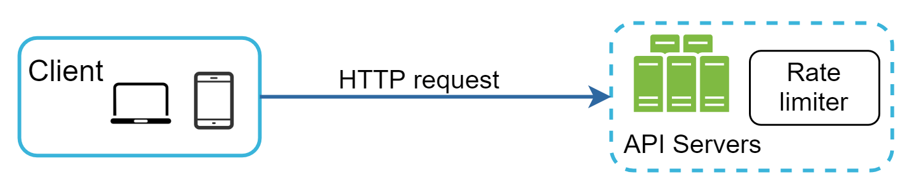
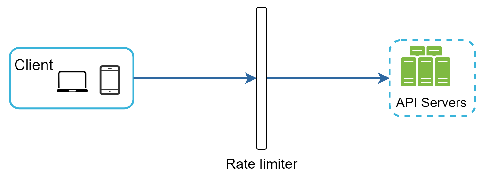
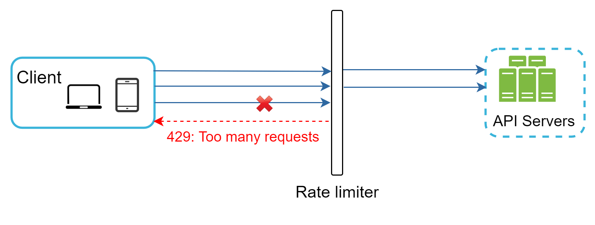
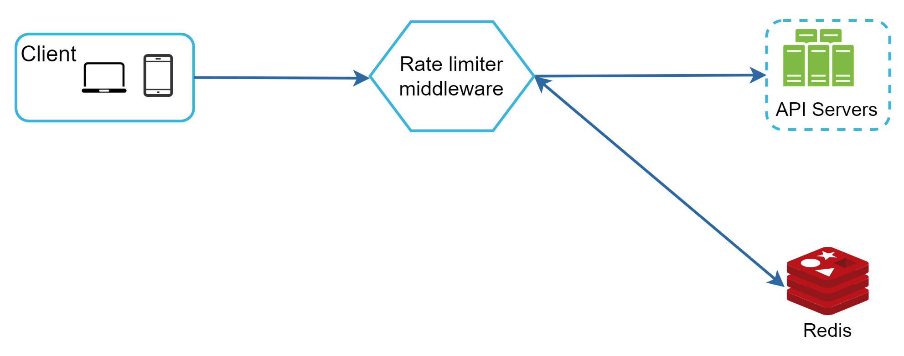

# Chapter 5: Design A Rate Limiter

> Source: [ByteByteGo - System Design Interview](https://bytebytego.com/courses/system-design-interview/design-a-rate-limiter)

In a network system, a rate limiter is used to control the rate of traffic sent by a client or a service. In the HTTP world, a rate limiter limits the number of client requests allowed to be sent over a specified period. If the API request count exceeds the threshold defined by the rate limiter, all the excess calls are blocked. Here are a few examples:

- A user can write no more than 2 posts per second.
- You can create a maximum of 10 accounts per day from the same IP address.
- You can claim rewards no more than 5 times per week from the same device.

In this chapter, you are asked to design a rate limiter. Before starting the design, we first look at the benefits of using an API rate limiter:

- **Prevent resource starvation caused by Denial of Service (DoS) attack.** Almost all APIs published by large tech companies enforce some form of rate limiting. For example, Twitter limits the number of tweets to 300 per 3 hours. Google docs APIs have the following default limit: 300 per user per 60 seconds for read requests. A rate limiter prevents DoS attacks, either intentional or unintentional, by blocking the excess calls.

- **Reduce cost.** Limiting excess requests means fewer servers and allocating more resources to high priority APIs. Rate limiting is extremely important for companies that use paid third party APIs. For example, you are charged on a per-call basis for the following external APIs: check credit, make a payment, retrieve health records, etc. Limiting the number of calls is essential to reduce costs.

- **Prevent servers from being overloaded.** To reduce server load, a rate limiter is used to filter out excess requests caused by bots or users' misbehavior.

---

## Step 1 - Understand the problem and establish design scope

Rate limiting can be implemented using different algorithms, each with its pros and cons. The interactions between an interviewer and a candidate help to clarify the type of rate limiters we are trying to build.

**Candidate**: What kind of rate limiter are we going to design? Is it a client-side rate limiter or server-side API rate limiter?
**Interviewer**: Great question. We focus on the server-side API rate limiter.

**Candidate**: Does the rate limiter throttle API requests based on IP, the user ID, or other properties?
**Interviewer**: The rate limiter should be flexible enough to support different sets of throttle rules.

**Candidate**: What is the scale of the system? Is it built for a startup or a big company with a large user base?
**Interviewer**: The system must be able to handle a large number of requests.

**Candidate**: Will the system work in a distributed environment?
**Interviewer**: Yes.

**Candidate**: Is the rate limiter a separate service or should it be implemented in application code?
**Interviewer**: It is a design decision up to you.

**Candidate**: Do we need to inform users who are throttled?
**Interviewer**: Yes.

**Requirements:**

- Accurately limit excessive requests.
- Low latency. The rate limiter should not slow down HTTP response time.
- Use as little memory as possible.
- Distributed rate limiting. The rate limiter can be shared across multiple servers or processes.
- Exception handling. Show clear exceptions to users when their requests are throttled.
- High fault tolerance. If there are any problems with the rate limiter (for example, a cache server goes offline), it does not affect the entire system.

---

## Step 2 - Propose high-level design and get buy-in

Let us keep things simple and use a basic client and server model for communication.

### Where to put the rate limiter?

Intuitively, you can implement a rate limiter at either the client or server-side.

- **Client-side implementation.** Generally speaking, client is an unreliable place to enforce rate limiting because client requests can easily be forged by malicious actors. Moreover, we might not have control over the client implementation.

- **Server-side implementation.** Figure 1 shows a rate limiter that is placed on the server-side.



*Figure 1: Rate limiter placed on the server-side alongside API servers.*

Besides the client and server-side implementations, there is an alternative way. Instead of putting a rate limiter at the API servers, we create a rate limiter middleware, which throttles requests to your APIs as shown in Figure 2.



*Figure 2: Rate limiter implemented as middleware between client and API servers.*

Let us use an example in Figure 3 to illustrate how rate limiting works in this design. Assume our API allows 2 requests per second, and a client sends 3 requests to the server within a second. The first two requests are routed to API servers. However, the rate limiter middleware throttles the third request and returns a HTTP status code 429. The HTTP 429 response status code indicates a user has sent too many requests.



*Figure 3: Rate limiter returning HTTP 429 Too Many Requests for excess traffic.*

Cloud microservices have become widely popular and rate limiting is usually implemented within a component called **API gateway**. API gateway is a fully managed service that supports rate limiting, SSL termination, authentication, IP whitelisting, servicing static content, etc. For now, we only need to know that the API gateway is a middleware that supports rate limiting.

Here are a few general guidelines for where to place the rate limiter:

- Evaluate your current technology stack, such as programming language, cache service, etc. Make sure your current programming language is efficient to implement rate limiting on the server-side.
- Identify the rate limiting algorithm that fits your business needs. When you implement everything on the server-side, you have full control of the algorithm. However, your choice might be limited if you use a third-party gateway.
- If you have already used microservice architecture and included an API gateway in the design to perform authentication, IP whitelisting, etc., you may add a rate limiter to the API gateway.
- Building your own rate limiting service takes time. If you do not have enough engineering resources to implement a rate limiter, a commercial API gateway is a better option.

---

### Algorithms for rate limiting

Rate limiting can be implemented using different algorithms, and each of them has distinct pros and cons. Here is a list of popular algorithms:

- Token bucket
- Leaking bucket
- Fixed window counter
- Sliding window log
- Sliding window counter

---

#### Token bucket algorithm

The token bucket algorithm is widely used for rate limiting. It is simple, well understood and commonly used by internet companies. Both Amazon and Stripe use this algorithm to throttle their API requests.

The token bucket algorithm works as follows:

- A token bucket is a container that has pre-defined capacity. Tokens are put in the bucket at preset rates periodically. Once the bucket is full, no more tokens are added.
- Each request consumes one token. When a request arrives, we check if there are enough tokens in the bucket.
- If there are enough tokens, we take one token out for each request, and the request goes through.
- If there are not enough tokens, the request is dropped.

The token bucket algorithm takes two parameters:

- **Bucket size**: the maximum number of tokens allowed in the bucket
- **Refill rate**: number of tokens put into the bucket every second

How many buckets do we need? This varies, and it depends on the rate-limiting rules:

- It is usually necessary to have different buckets for different API endpoints. For instance, if a user is allowed to make 1 post per second, add 150 friends per day, and like 5 posts per second, 3 buckets are required for each user.
- If we need to throttle requests based on IP addresses, each IP address requires a bucket.
- If the system allows a maximum of 10,000 requests per second, it makes sense to have a global bucket shared by all requests.

**Pros:**
- The algorithm is easy to implement.
- Memory efficient.
- Token bucket allows a burst of traffic for short periods. A request can go through as long as there are tokens left.

**Cons:**
- Two parameters in the algorithm are bucket size and token refill rate. However, it might be challenging to tune them properly.

### Java Example – Token Bucket Rate Limiter

```java
import java.util.concurrent.atomic.AtomicLong;

public class TokenBucketRateLimiter {
    private final long maxTokens;
    private final long refillRatePerSecond;
    private AtomicLong availableTokens;
    private long lastRefillTimestamp;

    public TokenBucketRateLimiter(long maxTokens, long refillRatePerSecond) {
        this.maxTokens = maxTokens;
        this.refillRatePerSecond = refillRatePerSecond;
        this.availableTokens = new AtomicLong(maxTokens);
        this.lastRefillTimestamp = System.nanoTime();
    }

    public synchronized boolean allowRequest() {
        refill();
        if (availableTokens.get() > 0) {
            availableTokens.decrementAndGet();
            return true;
        }
        return false;
    }

    private void refill() {
        long now = System.nanoTime();
        long elapsed = now - lastRefillTimestamp;
        long tokensToAdd = (elapsed / 1_000_000_000L) * refillRatePerSecond;
        if (tokensToAdd > 0) {
            availableTokens.set(Math.min(maxTokens,
                availableTokens.get() + tokensToAdd));
            lastRefillTimestamp = now;
        }
    }

    public static void main(String[] args) throws InterruptedException {
        TokenBucketRateLimiter limiter = new TokenBucketRateLimiter(5, 2);

        for (int i = 1; i <= 10; i++) {
            boolean allowed = limiter.allowRequest();
            System.out.printf("Request %2d: %s%n", i,
                allowed ? "✅ Allowed" : "❌ Rejected (429)");
            Thread.sleep(200); // 200ms between requests
        }
    }
}
```

---

#### Leaking bucket algorithm

The leaking bucket algorithm is similar to the token bucket except that requests are processed at a fixed rate. It is usually implemented with a first-in-first-out (FIFO) queue. The algorithm works as follows:

- When a request arrives, the system checks if the queue is full. If it is not full, the request is added to the queue.
- Otherwise, the request is dropped.
- Requests are pulled from the queue and processed at regular intervals.

Leaking bucket algorithm takes the following two parameters:

- **Bucket size**: it is equal to the queue size. The queue holds the requests to be processed at a fixed rate.
- **Outflow rate**: it defines how many requests can be processed at a fixed rate, usually in seconds.

Shopify, an ecommerce company, uses leaky buckets for rate-limiting.

**Pros:**
- Memory efficient given the limited queue size.
- Requests are processed at a fixed rate therefore it is suitable for use cases that a stable outflow rate is needed.

**Cons:**
- A burst of traffic fills up the queue with old requests, and if they are not processed in time, recent requests will be rate limited.
- There are two parameters in the algorithm. It might not be easy to tune them properly.

### Java Example – Leaking Bucket Rate Limiter

```java
import java.util.LinkedList;
import java.util.Queue;
import java.util.concurrent.*;

public class LeakyBucketRateLimiter {
    private final int bucketSize;
    private final Queue<Runnable> queue;

    public LeakyBucketRateLimiter(int bucketSize, int outflowRatePerSecond) {
        this.bucketSize = bucketSize;
        this.queue = new LinkedList<>();

        // Process requests at a fixed rate
        ScheduledExecutorService executor = Executors.newSingleThreadScheduledExecutor();
        long intervalMs = 1000L / outflowRatePerSecond;
        executor.scheduleAtFixedRate(() -> {
            Runnable task = queue.poll();
            if (task != null) {
                task.run();
            }
        }, 0, intervalMs, TimeUnit.MILLISECONDS);
    }

    public synchronized boolean submitRequest(Runnable task) {
        if (queue.size() < bucketSize) {
            queue.add(task);
            return true; // Accepted into queue
        }
        return false; // Queue full, request dropped
    }

    public static void main(String[] args) throws InterruptedException {
        LeakyBucketRateLimiter limiter = new LeakyBucketRateLimiter(5, 2);

        for (int i = 1; i <= 10; i++) {
            int reqId = i;
            boolean accepted = limiter.submitRequest(
                () -> System.out.println("  Processing request " + reqId));
            System.out.printf("Request %2d: %s%n", i,
                accepted ? "✅ Queued" : "❌ Dropped");
        }

        Thread.sleep(5000); // Wait for processing
    }
}
```

---

#### Fixed window counter algorithm

Fixed window counter algorithm works as follows:

- The algorithm divides the timeline into fix-sized time windows and assign a counter for each window.
- Each request increments the counter by one.
- Once the counter reaches the pre-defined threshold, new requests are dropped until a new time window starts.

**Pros:**
- Memory efficient.
- Easy to understand.
- Resetting available quota at the end of a unit time window fits certain use cases.

**Cons:**
- Spike in traffic at the edges of a window could cause more requests than the allowed quota to go through.

---

#### Sliding window log algorithm

The sliding window log algorithm fixes the issue of the fixed window counter. It works as follows:

- The algorithm keeps track of request timestamps. Timestamp data is usually kept in cache, such as sorted sets of Redis.
- When a new request comes in, remove all the outdated timestamps. Outdated timestamps are defined as those older than the start of the current time window.
- Add timestamp of the new request to the log.
- If the log size is the same or lower than the allowed count, a request is accepted. Otherwise, it is rejected.

**Pros:**
- Rate limiting implemented by this algorithm is very accurate. In any rolling window, requests will not exceed the rate limit.

**Cons:**
- The algorithm consumes a lot of memory because even if a request is rejected, its timestamp might still be stored in memory.

---

#### Sliding window counter algorithm

The sliding window counter algorithm is a hybrid approach that combines the fixed window counter and sliding window log.

Assume the rate limiter allows a maximum of 7 requests per minute, and there are 5 requests in the previous minute and 3 in the current minute. For a new request that arrives at a 30% position in the current minute, the number of requests in the rolling window is calculated using the following formula:

- Requests in current window **+** requests in the previous window **×** overlap percentage of the rolling window and previous window
- Using this formula, we get 3 + 5 * 0.7% = 6.5 request. Depending on the use case, the number can either be rounded up or down. In our example, it is rounded down to 6.

**Pros:**
- It smooths out spikes in traffic because the rate is based on the average rate of the previous window.
- Memory efficient.

**Cons:**
- It only works for not-so-strict look back window. It is an approximation of the actual rate because it assumes requests in the previous window are evenly distributed. According to experiments done by Cloudflare, only 0.003% of requests are wrongly allowed or rate limited among 400 million requests.

### Java Example – Sliding Window Counter

```java
import java.util.concurrent.atomic.AtomicInteger;

public class SlidingWindowCounter {
    private final int maxRequests;
    private final long windowSizeMs;
    private AtomicInteger previousWindowCount = new AtomicInteger(0);
    private AtomicInteger currentWindowCount = new AtomicInteger(0);
    private long windowStart;

    public SlidingWindowCounter(int maxRequests, long windowSizeMs) {
        this.maxRequests = maxRequests;
        this.windowSizeMs = windowSizeMs;
        this.windowStart = System.currentTimeMillis();
    }

    public synchronized boolean allowRequest() {
        long now = System.currentTimeMillis();
        long elapsed = now - windowStart;

        // Roll window if needed
        if (elapsed >= windowSizeMs) {
            previousWindowCount.set(currentWindowCount.get());
            currentWindowCount.set(0);
            windowStart = now;
            elapsed = 0;
        }

        // Calculate weighted count
        double overlapRatio = 1.0 - ((double) elapsed / windowSizeMs);
        double estimatedCount = previousWindowCount.get() * overlapRatio
                              + currentWindowCount.get();

        if (estimatedCount < maxRequests) {
            currentWindowCount.incrementAndGet();
            return true;
        }
        return false;
    }

    public static void main(String[] args) throws InterruptedException {
        // Allow max 5 requests per 10 seconds
        SlidingWindowCounter limiter = new SlidingWindowCounter(5, 10_000);

        for (int i = 1; i <= 12; i++) {
            boolean allowed = limiter.allowRequest();
            System.out.printf("Request %2d: %s%n", i,
                allowed ? "✅ Allowed" : "❌ Rate Limited (429)");
            Thread.sleep(500);
        }
    }
}
```

---

### High-level architecture

The basic idea of rate limiting algorithms is simple. At the high-level, we need a counter to keep track of how many requests are sent from the same user, IP address, etc. If the counter is larger than the limit, the request is disallowed.

Where shall we store counters? Using the database is not a good idea due to slowness of disk access. In-memory cache is chosen because it is fast and supports time-based expiration strategy. For instance, Redis is a popular option to implement rate limiting. It is an in-memory store that offers two commands: INCR and EXPIRE.

- **INCR**: It increases the stored counter by 1.
- **EXPIRE**: It sets a timeout for the counter. If the timeout expires, the counter is automatically deleted.



*Figure 12: Client → Rate Limiter Middleware → API Servers, with Redis for counter storage.*

---

## Step 3 - Design deep dive

### Rate limiting rules

Lyft open-sourced their rate-limiting component. Here are some examples of rate limiting rules:

```yaml
domain: messaging
descriptors:
  - key: message_type
    value: marketing
    rate_limit:
      unit: day
      requests_per_unit: 5
```

```yaml
domain: auth
descriptors:
  - key: auth_type
    value: login
    rate_limit:
      unit: minute
      requests_per_unit: 5
```

Rules are generally written in configuration files and saved on disk.

### Exceeding the rate limit

In case a request is rate limited, APIs return a HTTP response code **429 (too many requests)** to the client. Depending on the use cases, we may enqueue the rate-limited requests to be processed later.

#### Rate limiter headers

The rate limiter returns the following HTTP headers to clients:

```
X-Ratelimit-Remaining: The remaining number of allowed requests within the window.
X-Ratelimit-Limit: It indicates how many calls the client can make per time window.
X-Ratelimit-Retry-After: The number of seconds to wait until you can make a request again without being throttled.
```

### Rate limiter in a distributed environment

Building a rate limiter that works in a single server environment is not difficult. However, scaling the system to support multiple servers and concurrent threads is a different story. There are two challenges:

- **Race condition**: If two requests concurrently read the counter value before either of them writes the value back, each will increment the counter by one and write it back without checking the other thread. Solution: Use Lua scripts or Redis sorted sets for atomic operations.

- **Synchronization issue**: When multiple rate limiter servers are used, synchronization is required. Solution: Use centralized data stores like Redis.

### Performance optimization

- **Multi-data center setup** is crucial for a rate limiter because latency is high for users located far away from the data center. Traffic is automatically routed to the closest edge server to reduce latency.

- **Synchronize data with an eventual consistency model.**

### Monitoring

After the rate limiter is put in place, it is important to gather analytics data to check whether the rate limiter is effective. Primarily, we want to make sure:

- The rate limiting algorithm is effective.
- The rate limiting rules are effective.

---

## Step 4 - Wrap up

In this chapter, we discussed different algorithms of rate limiting and their pros/cons:

| Algorithm | Pros | Cons |
|-----------|------|------|
| Token bucket | Easy to implement, memory efficient, allows burst | Hard to tune parameters |
| Leaking bucket | Memory efficient, stable outflow | Burst fills with old requests |
| Fixed window | Memory efficient, easy to understand | Edge-of-window spike issue |
| Sliding window log | Very accurate | High memory usage |
| Sliding window counter | Smooths spikes, memory efficient | Approximate, not strict |

Additional talking points:

- **Hard vs soft rate limiting.**
  - Hard: The number of requests cannot exceed the threshold.
  - Soft: Requests can exceed the threshold for a short period.

- **Rate limiting at different levels.** In this chapter, we only talked about rate limiting at the application level (HTTP: layer 7). It is possible to apply rate limiting at other layers. For example, you can apply rate limiting by IP addresses using Iptables (IP: layer 3).

- **Avoid being rate limited.** Design your client with best practices:
  - Use client cache to avoid making frequent API calls.
  - Understand the limit and do not send too many requests in a short time frame.
  - Include code to catch exceptions or errors so your client can gracefully recover from exceptions.
  - Add sufficient back off time to retry logic.

---

## Reference materials

[1] Rate-limiting strategies and techniques: [https://cloud.google.com/solutions/rate-limiting-strategies-techniques](https://cloud.google.com/solutions/rate-limiting-strategies-techniques)

[2] Twitter rate limits: [https://developer.twitter.com/en/docs/basics/rate-limits](https://developer.twitter.com/en/docs/basics/rate-limits)

[3] Google docs usage limits: [https://developers.google.com/docs/api/limits](https://developers.google.com/docs/api/limits)

[4] IBM microservices: [https://www.ibm.com/cloud/learn/microservices](https://www.ibm.com/cloud/learn/microservices)

[5] Throttle API requests for better throughput: [https://docs.aws.amazon.com/apigateway/latest/developerguide/api-gateway-request-throttling.html](https://docs.aws.amazon.com/apigateway/latest/developerguide/api-gateway-request-throttling.html)

[6] Stripe rate limiters: [https://stripe.com/blog/rate-limiters](https://stripe.com/blog/rate-limiters)

[7] Shopify REST Admin API rate limits: [https://help.shopify.com/en/api/reference/rest-admin-api-rate-limits](https://help.shopify.com/en/api/reference/rest-admin-api-rate-limits)

[8] Better Rate Limiting With Redis Sorted Sets: [https://engineering.classdojo.com/blog/2015/02/06/rolling-rate-limiter/](https://engineering.classdojo.com/blog/2015/02/06/rolling-rate-limiter/)

[9] System Design — Rate limiter and Data modelling: [https://medium.com/@saisandeepmopuri/system-design-rate-limiter-and-data-modelling-9304b0d18250](https://medium.com/@saisandeepmopuri/system-design-rate-limiter-and-data-modelling-9304b0d18250)

[10] How we built rate limiting capable of scaling to millions of domains: [https://blog.cloudflare.com/counting-things-a-lot-of-different-things/](https://blog.cloudflare.com/counting-things-a-lot-of-different-things/)

[11] Redis website: [https://redis.io/](https://redis.io/)

[12] Lyft rate limiting: [https://github.com/lyft/ratelimit](https://github.com/lyft/ratelimit)

[13] Scaling your API with rate limiters: [https://gist.github.com/ptarjan/e38f45f2dfe601419ca3af937fff574d#request-rate-limiter](https://gist.github.com/ptarjan/e38f45f2dfe601419ca3af937fff574d#request-rate-limiter)

[14] What is edge computing: [https://www.cloudflare.com/learning/serverless/glossary/what-is-edge-computing/](https://www.cloudflare.com/learning/serverless/glossary/what-is-edge-computing/)

[15] Rate Limit Requests with Iptables: [https://blog.programster.org/rate-limit-requests-with-iptables](https://blog.programster.org/rate-limit-requests-with-iptables)

[16] OSI model: [https://en.wikipedia.org/wiki/OSI_model#Layer_architecture](https://en.wikipedia.org/wiki/OSI_model#Layer_architecture)
