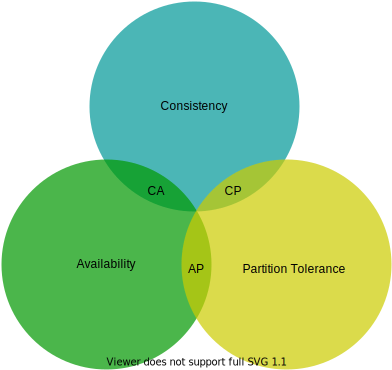

# Chapter 7: Design A Key-value Store

> Source: [ByteByteGo - System Design Interview](https://bytebytego.com/courses/system-design-interview/design-a-key-value-store)

A key-value store, also referred to as a key-value database, is a non-relational database. Each unique identifier is stored as a key with its associated value. This data pairing is known as a "key-value" pair.

In a key-value pair, the key must be unique, and the value associated with the key can be accessed through the key. Keys can be plain text or hashed values. For performance reasons, a short key works better. Examples:

- Plain text key: "last_logged_in_at"
- Hashed key: 253DDEC4

The value in a key-value pair can be strings, lists, objects, etc. The value is usually treated as an opaque object in key-value stores, such as Amazon Dynamo [1], Memcached [2], Redis [3], etc.

| **key** | **value** |
|---------|-----------|
| 145     | john      |
| 147     | bob       |
| 160     | julia     |

*Table 1: Simple key-value store data.*

In this chapter, you are asked to design a key-value store that supports:

- `put(key, value)` // insert "value" associated with "key"
- `get(key)` // get "value" associated with "key"

---

## Understand the problem and establish design scope

There is no perfect design. Each design achieves a specific balance regarding the tradeoffs of the read, write, and memory usage. We design a key-value store with these characteristics:

- The size of a key-value pair is small: less than 10 KB.
- Ability to store big data.
- High availability: The system responds quickly, even during failures.
- High scalability: The system can be scaled to support large data set.
- Automatic scaling: The addition/deletion of servers should be automatic based on traffic.
- Tunable consistency.
- Low latency.

---

## Single server key-value store

Developing a key-value store that resides in a single server is easy. An intuitive approach is to store key-value pairs in a hash table, which keeps everything in memory. Two optimizations can be done:

- Data compression
- Store only frequently used data in memory and the rest on disk

Even with these optimizations, a single server can reach its capacity very quickly. A distributed key-value store is required to support big data.

### Java Example – Simple In-Memory Key-Value Store

```java
import java.util.concurrent.ConcurrentHashMap;

public class SimpleKeyValueStore {
    private final ConcurrentHashMap<String, String> store = new ConcurrentHashMap<>();

    public void put(String key, String value) {
        store.put(key, value);
    }

    public String get(String key) {
        return store.get(key);
    }

    public void delete(String key) {
        store.remove(key);
    }

    public static void main(String[] args) {
        SimpleKeyValueStore kvStore = new SimpleKeyValueStore();
        kvStore.put("user:1001", "john");
        kvStore.put("user:1002", "bob");
        kvStore.put("user:1003", "julia");

        System.out.println("user:1001 = " + kvStore.get("user:1001")); // john
        System.out.println("user:1002 = " + kvStore.get("user:1002")); // bob
    }
}
```

---

## Distributed key-value store

A distributed key-value store is also called a distributed hash table, which distributes key-value pairs across many servers. When designing a distributed system, it is important to understand **CAP** (**C**onsistency, **A**vailability, **P**artition Tolerance) theorem.

### CAP theorem

CAP theorem states it is impossible for a distributed system to simultaneously provide more than two of these three guarantees: consistency, availability, and partition tolerance.

- **Consistency**: all clients see the same data at the same time no matter which node they connect to.
- **Availability**: any client which requests data gets a response even if some of the nodes are down.
- **Partition Tolerance**: a partition indicates a communication break between two nodes. Partition tolerance means the system continues to operate despite network partitions.

CAP theorem states that one of the three properties must be sacrificed to support 2 of the 3 properties:

- **CP systems**: supports consistency and partition tolerance while sacrificing availability.
- **AP systems**: supports availability and partition tolerance while sacrificing consistency.
- **CA systems**: supports consistency and availability while sacrificing partition tolerance. Since network failure is unavoidable, a CA system cannot exist in real-world applications.



#### Ideal situation

In the ideal world, network partition never occurs. Data written to *n1* is automatically replicated to *n2* and *n3*. Both consistency and availability are achieved.

#### Real-world distributed systems

In a distributed system, partitions cannot be avoided, and when a partition occurs, we must choose between consistency and availability.

- **CP system**: Block all write operations to avoid data inconsistency. Bank systems usually have extremely high consistent requirements.
- **AP system**: Keep accepting reads (even stale data) and writes, sync data when partition is resolved.

---

### System components

Core components and techniques used to build a key-value store:

- Data partition
- Data replication
- Consistency
- Inconsistency resolution
- Handling failures
- System architecture diagram
- Write path
- Read path

The content below is largely based on three popular key-value store systems: Dynamo [4], Cassandra [5], and BigTable [6].

### Data partition

Using consistent hashing to partition data has the following advantages:

- **Automatic scaling**: servers could be added and removed automatically depending on the load.
- **Heterogeneity**: the number of virtual nodes for a server is proportional to the server capacity.

### Data replication

To achieve high availability and reliability, data must be replicated asynchronously over *N* servers. These *N* servers are chosen by walking clockwise from the key's position on the hash ring and choosing the first *N* unique servers.

Nodes in the same data center often fail at the same time, so replicas are placed in distinct data centers connected through high-speed networks.

### Consistency – Quorum consensus

- ***N*** = The number of replicas
- ***W*** = A write quorum of size W. Write must be acknowledged from W replicas.
- ***R*** = A read quorum of size R. Read must wait for responses from at least R replicas.

| Configuration | Behavior |
|---------------|----------|
| R = 1, W = N | Optimized for fast read |
| W = 1, R = N | Optimized for fast write |
| W + R > N | Strong consistency guaranteed (Usually N = 3, W = R = 2) |
| W + R ≤ N | Strong consistency NOT guaranteed |

#### Consistency models

- **Strong consistency**: any read returns the most updated write. Client never sees out-of-date data.
- **Weak consistency**: subsequent reads may not see the most updated value.
- **Eventual consistency**: given enough time, all updates are propagated and all replicas are consistent.

Dynamo and Cassandra adopt eventual consistency.

### Inconsistency resolution: versioning

Versioning means treating each data modification as a new immutable version. **Vector clocks** `[server, version]` pairs are used to detect and resolve conflicts.

A vector clock *D([S1, v1], [S2, v2], …, [Sn, vn])* where D is a data item, v is a version counter, and S is a server number.

### Java Example – Vector Clock

```java
import java.util.*;

public class VectorClock {
    private final Map<String, Integer> clock = new HashMap<>();

    public void increment(String serverId) {
        clock.merge(serverId, 1, Integer::sum);
    }

    public boolean isAncestorOf(VectorClock other) {
        for (Map.Entry<String, Integer> entry : this.clock.entrySet()) {
            if (other.clock.getOrDefault(entry.getKey(), 0) < entry.getValue()) {
                return false;
            }
        }
        return true;
    }

    public boolean conflictsWith(VectorClock other) {
        return !this.isAncestorOf(other) && !other.isAncestorOf(this);
    }

    @Override
    public String toString() {
        return clock.toString();
    }

    public static void main(String[] args) {
        VectorClock v1 = new VectorClock();
        v1.increment("Sx"); v1.increment("Sx"); v1.increment("Sy");
        // D3([Sx,2], [Sy,1])

        VectorClock v2 = new VectorClock();
        v2.increment("Sx"); v2.increment("Sx"); v2.increment("Sz");
        // D4([Sx,2], [Sz,1])

        System.out.println("V1: " + v1);
        System.out.println("V2: " + v2);
        System.out.println("V1 ancestor of V2? " + v1.isAncestorOf(v2));
        System.out.println("Conflict? " + v1.conflictsWith(v2)); // true
    }
}
```

---

### Handling failures

#### Failure detection – Gossip protocol

- Each node maintains a node membership list with member IDs and heartbeat counters.
- Each node periodically increments its heartbeat counter.
- Each node periodically sends heartbeats to a set of random nodes, which propagate to others.
- If the heartbeat has not increased for a predefined period, the member is considered offline.

#### Handling temporary failures – Sloppy quorum & Hinted handoff

Instead of enforcing strict quorum, the system chooses the first W healthy servers for writes and first R healthy servers for reads. When the down server comes back, changes are pushed back.

#### Handling permanent failures – Merkle tree

Anti-entropy protocol keeps replicas in sync using **Merkle trees** for inconsistency detection:

1. Divide key space into buckets
2. Hash each key in a bucket
3. Create a single hash node per bucket
4. Build tree upwards till root by calculating hashes of children

To compare two Merkle trees, start by comparing root hashes. If they disagree, traverse the tree to find which buckets are not synchronized.

#### Handling data center outage

Replicate data across multiple data centers.

---

### Write path

1. The write request is persisted on a commit log file.
2. Data is saved in the memory cache.
3. When the memory cache is full, data is flushed to SSTable on disk.

### Read path

1. Check if data is in memory cache. If so, return.
2. If not in memory, check the bloom filter.
3. Bloom filter identifies which SSTables might contain the key.
4. SSTables return the result.
5. Result is returned to the client.

---

## Summary

| Goal/Problem | Technique |
|-------------|-----------|
| Store big data | Consistent hashing to spread load |
| High availability reads | Data replication, Multi-datacenter setup |
| Highly available writes | Versioning and conflict resolution with vector clocks |
| Dataset partition | Consistent Hashing |
| Incremental scalability | Consistent Hashing |
| Heterogeneity | Consistent Hashing |
| Tunable consistency | Quorum consensus |
| Handling temporary failures | Sloppy quorum and hinted handoff |
| Handling permanent failures | Merkle tree |
| Handling data center outage | Cross-datacenter replication |

*Table 2: Summary of techniques for a distributed key-value store.*

---

## Reference materials

[1] Amazon DynamoDB: [https://aws.amazon.com/dynamodb/](https://aws.amazon.com/dynamodb/)

[2] memcached: [https://memcached.org/](https://memcached.org/)

[3] Redis: [https://redis.io/](https://redis.io/)

[4] Dynamo: Amazon's Highly Available Key-value Store: [https://www.allthingsdistributed.com/files/amazon-dynamo-sosp2007.pdf](https://www.allthingsdistributed.com/files/amazon-dynamo-sosp2007.pdf)

[5] Cassandra: [https://cassandra.apache.org/](https://cassandra.apache.org/)

[6] Bigtable: A Distributed Storage System for Structured Data: [https://static.googleusercontent.com/media/research.google.com/en//archive/bigtable-osdi06.pdf](https://static.googleusercontent.com/media/research.google.com/en//archive/bigtable-osdi06.pdf)

[7] Merkle tree: [https://en.wikipedia.org/wiki/Merkle_tree](https://en.wikipedia.org/wiki/Merkle_tree)

[8] Cassandra architecture: [https://cassandra.apache.org/doc/latest/architecture/](https://cassandra.apache.org/doc/latest/architecture/)

[9] SStable: [https://www.igvita.com/2012/02/06/sstable-and-log-structured-storage-leveldb/](https://www.igvita.com/2012/02/06/sstable-and-log-structured-storage-leveldb/)

[10] Bloom filter: [https://en.wikipedia.org/wiki/Bloom_filter](https://en.wikipedia.org/wiki/Bloom_filter)
