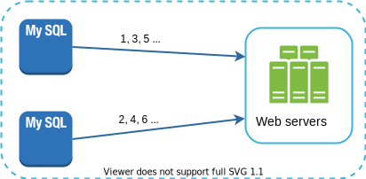
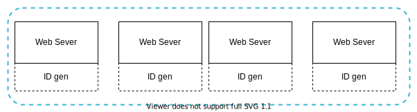

# Chapter 8: Design A Unique ID Generator In Distributed Systems

> Source: [ByteByteGo - System Design Interview](https://bytebytego.com/courses/system-design-interview/design-a-unique-id-generator-in-distributed-systems)

In distributed systems, generating unique IDs with a central `auto_increment` feature in a traditional database server is not scalable due to latency and single points of failure. This chapter explores multiple approaches to solve this problem.

---

## Step 1 - Understand the problem and establish design scope

**Candidate**: What are the characteristics of unique IDs?
**Interviewer**: IDs must be unique and sortable.

**Candidate**: For each new record, does ID increment by 1?
**Interviewer**: The ID increments by time but not necessarily only increments by 1.

**Candidate**: Do IDs only contain numerical values?
**Interviewer**: Yes, that is correct.

**Candidate**: What is the ID length requirement?
**Interviewer**: IDs should fit into 64-bit.

**Candidate**: What is the scale of the system?
**Interviewer**: Should be able to generate 10,000 IDs per second.

---

## Step 2 - Propose high-level design

### Option 1: Multi-master replication

Uses databases' `auto_increment` feature. Instead of increasing by 1, we increase by *k*, where *k* is the number of database servers in use.


**Pros:**
- Scales with the number of database servers

**Cons:**
- Hard to scale with multiple data centers
- IDs do not go up with time across servers
- Does not scale well when a server is added or removed

### Option 2: UUID (Universally Unique Identifier)

UUID is a 128-bit number used to identify information in computer systems. UUID has a very low probability of collision.

Example: `09c93e62-50b4-468d-bf8a-c07e1040bfb2`



**Pros:**
- Simple. No coordination between servers needed.
- Each server generates its own IDs independently. Easy to scale.

**Cons:**
- 128 bits long, but requirement is 64-bit.
- IDs do not go up with time.
- IDs could be non-numeric.

### Option 3: Ticket Server

Flickr developed ticket servers to generate distributed primary keys. The idea is to use a centralized `auto_increment` feature in a single database server (Ticket Server).



**Pros:**
- Numeric IDs, easy to implement. Works for small to medium-scale applications.

**Cons:**
- Single point of failure (SPOF). Multiple ticket servers can be set up, but introduces data synchronization challenges.

### Option 4: Twitter Snowflake approach ⭐ (Recommended)

Instead of generating an ID directly, we divide a 64-bit ID into different sections:


| Section | Bits | Description |
|---------|------|-------------|
| Sign bit | 1 | Always 0. Reserved for future use. |
| Timestamp | 41 | Milliseconds since custom epoch |
| Datacenter ID | 5 | 2^5 = 32 datacenters |
| Machine ID | 5 | 2^5 = 32 machines per datacenter |
| Sequence number | 12 | Reset to 0 every millisecond; up to 4096 per ms per machine |

### Java Example – Snowflake ID Generator

```java
public class SnowflakeIdGenerator {
    private static final long EPOCH = 1288834974657L; // Custom epoch (Twitter's)

    private static final long DATACENTER_ID_BITS = 5L;
    private static final long MACHINE_ID_BITS = 5L;
    private static final long SEQUENCE_BITS = 12L;

    private static final long MAX_DATACENTER_ID = ~(-1L << DATACENTER_ID_BITS); // 31
    private static final long MAX_MACHINE_ID = ~(-1L << MACHINE_ID_BITS); // 31
    private static final long MAX_SEQUENCE = ~(-1L << SEQUENCE_BITS); // 4095

    private static final long MACHINE_ID_SHIFT = SEQUENCE_BITS;
    private static final long DATACENTER_ID_SHIFT = SEQUENCE_BITS + MACHINE_ID_BITS;
    private static final long TIMESTAMP_SHIFT = SEQUENCE_BITS + MACHINE_ID_BITS + DATACENTER_ID_BITS;

    private final long datacenterId;
    private final long machineId;
    private long sequence = 0L;
    private long lastTimestamp = -1L;

    public SnowflakeIdGenerator(long datacenterId, long machineId) {
        if (datacenterId > MAX_DATACENTER_ID || datacenterId < 0) {
            throw new IllegalArgumentException("Datacenter ID out of range");
        }
        if (machineId > MAX_MACHINE_ID || machineId < 0) {
            throw new IllegalArgumentException("Machine ID out of range");
        }
        this.datacenterId = datacenterId;
        this.machineId = machineId;
    }

    public synchronized long nextId() {
        long timestamp = System.currentTimeMillis();

        if (timestamp < lastTimestamp) {
            throw new RuntimeException("Clock moved backwards!");
        }

        if (timestamp == lastTimestamp) {
            sequence = (sequence + 1) & MAX_SEQUENCE;
            if (sequence == 0) {
                // Wait for next millisecond
                while (timestamp <= lastTimestamp) {
                    timestamp = System.currentTimeMillis();
                }
            }
        } else {
            sequence = 0;
        }

        lastTimestamp = timestamp;

        return ((timestamp - EPOCH) << TIMESTAMP_SHIFT)
             | (datacenterId << DATACENTER_ID_SHIFT)
             | (machineId << MACHINE_ID_SHIFT)
             | sequence;
    }

    public static void main(String[] args) {
        SnowflakeIdGenerator generator = new SnowflakeIdGenerator(1, 1);

        System.out.println("=== Snowflake ID Generator ===");
        for (int i = 0; i < 10; i++) {
            long id = generator.nextId();
            System.out.printf("ID: %d (binary: %s)%n", id, Long.toBinaryString(id));
        }

        // Parse an ID back
        long sampleId = generator.nextId();
        long ts = (sampleId >> 22) + EPOCH;
        long dc = (sampleId >> 17) & 0x1F;
        long mc = (sampleId >> 12) & 0x1F;
        long seq = sampleId & 0xFFF;
        System.out.printf("%nParsed ID %d:%n  Timestamp: %d%n  Datacenter: %d%n  Machine: %d%n  Sequence: %d%n",
            sampleId, ts, dc, mc, seq);
    }
}
```

---

## Step 3 - Design deep dive

### Timestamp

- The 41-bit timestamp supports ~69 years: `2^41 - 1 = 2,199,023,255,551 ms ≈ 69 years`
- Using a custom epoch close to today's date delays the overflow
- After 69 years, a new epoch or migration strategy is needed

### Sequence Number

- 12 bits = 4096 unique IDs per millisecond per machine
- Sequence resets to 0 every millisecond
- Only increments when multiple IDs are generated in the same ms on the same machine

---

## Step 4 - Wrap up

Additional talking points:
- **Clock synchronization**: Use NTP (Network Time Protocol) to keep clocks in sync across servers
- **Section length tuning**: Trading off datacenter/machine bits vs sequence bits based on concurrency needs
- **High availability**: The generator must be highly available since it's a critical component

---

## Reference materials

[1] Universally unique identifier: [https://en.wikipedia.org/wiki/Universally_unique_identifier](https://en.wikipedia.org/wiki/Universally_unique_identifier)

[2] Ticket Servers: Distributed Unique Primary Keys on the Cheap: [https://code.flickr.net/2010/02/08/ticket-servers-distributed-unique-primary-keys-on-the-cheap/](https://code.flickr.net/2010/02/08/ticket-servers-distributed-unique-primary-keys-on-the-cheap/)

[3] Announcing Snowflake: [https://blog.twitter.com/engineering/en_us/a/2010/announcing-snowflake.html](https://blog.twitter.com/engineering/en_us/a/2010/announcing-snowflake.html)

[4] Network time protocol: [https://en.wikipedia.org/wiki/Network_Time_Protocol](https://en.wikipedia.org/wiki/Network_Time_Protocol)
