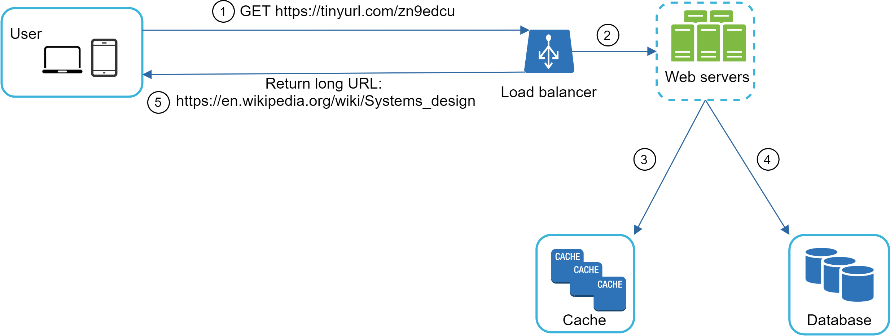

# Chapter 9: Design A URL Shortener

> Source: [ByteByteGo - System Design Interview](https://bytebytego.com/courses/system-design-interview/design-a-url-shortener)

In this chapter, we will tackle an interesting and classic system design interview question: designing a URL shortening service like tinyurl.

---

## Step 1 - Understand the problem and establish design scope

System design interview questions are intentionally left open-ended. To design a well-crafted system, it is critical to ask clarification questions.

**Candidate**: Can you give an example of how a URL shortener work?
**Interviewer**: Assume URL https://www.systeminterview.com/q=chatsystem&c=loggedin&v=v3&l=long is the original URL. Your service creates an alias with shorter length: https://tinyurl.com/y7keocwj. If you click the alias, it redirects you to the original URL.

**Candidate**: What is the traffic volume?
**Interviewer**: 100 million URLs are generated per day.

**Candidate**: How long is the shortened URL?
**Interviewer**: As short as possible.

**Candidate**: What characters are allowed in the shortened URL?
**Interviewer**: Shortened URL can be a combination of numbers (0-9) and characters (a-z, A-Z).

**Candidate**: Can shortened URLs be deleted or updated?
**Interviewer**: For simplicity, let us assume shortened URLs cannot be deleted or updated.

Here are the basic use cases:

- **URL shortening**: given a long URL => return a much shorter URL
- **URL redirecting**: given a shorter URL => redirect to the original URL
- High availability, scalability, and fault tolerance considerations

**Back of the envelope estimation:**

- Write operation: 100 million URLs are generated per day.
- Write operation per second: 100 million / 24 / 3600 = 1160
- Read operation: Assuming ratio of read operation to write operation is 10:1, read operation per second: 1160 * 10 = 11,600
- Assuming the URL shortener service will run for 10 years, this means we must support 100 million * 365 * 10 = 365 billion records.
- Assume average URL length is 100.
- Storage requirement over 10 years: 365 billion * 100 bytes = 36.5 TB

---

## Step 2 - Propose high-level design and get buy-in

In this section, we discuss the API endpoints, URL redirecting, and URL shortening flows.

### API Endpoints

API endpoints facilitate the communication between clients and servers. We will design the APIs REST-style. A URL shortener primarily needs two API endpoints.

**1. URL shortening.** To create a new short URL, a client sends a POST request, which contains one parameter: the original long URL. The API looks like this:

```
POST api/v1/data/shorten
- request parameter: {longUrl: longURLString}
- return: shortURL
```

**2. URL redirecting.** To redirect a short URL to the corresponding long URL, a client sends a GET request:

```
GET api/v1/shortUrl
- return: longURL for HTTP redirection
```

### URL redirecting

Figure 1 shows what happens when you enter a tinyurl onto the browser. Once the server receives a tinyurl request, it changes the short URL to the long URL with 301 redirect.


One thing worth discussing here is **301 redirect vs 302 redirect**:

- **301 redirect**: A 301 redirect shows that the requested URL is "permanently" moved to the long URL. Since it is permanently redirected, the browser caches the response, and subsequent requests for the same URL will not be sent to the URL shortening service. Instead, requests are redirected to the long URL server directly.

- **302 redirect**: A 302 redirect means that the URL is "temporarily" moved to the long URL, meaning that subsequent requests for the same URL will be sent to the URL shortening service first. Then, they are redirected to the long URL server.

Each redirection method has its pros and cons. If the priority is to reduce the server load, using 301 redirect makes sense as only the first request of the same URL is sent to URL shortening servers. However, if analytics is important, 302 redirect is a better choice as it can track click rate and source of the click more easily.

The most intuitive way to implement URL redirecting is to use hash tables. Assuming the hash table stores `<shortURL, longURL>` pairs, URL redirecting can be implemented by the following:

```
Get longURL: longURL = hashTable.get(shortURL)
Once you get the longURL, perform the URL redirect.
```

### URL shortening

Let us assume the short URL looks like this: `www.tinyurl.com/{hashValue}`. To support the URL shortening use case, we must find a hash function `fx` that maps a long URL to the *hashValue*.

The hash function must satisfy the following requirements:
- Each longURL must be hashed to one hashValue.
- Each hashValue can be mapped back to the longURL.

---

## Step 3 - Design deep dive

Up until now, we have discussed the high-level design of URL shortening and URL redirecting. In this section, we dive deep into the following: data model, hash function, URL shortening, and URL redirecting.

### Data model

In the high-level design, everything is stored in a hash table. This is a good starting point; however, this approach is not feasible for real-world systems as memory resources are limited and expensive. A better option is to store `<shortURL, longURL>` mapping in a relational database. The simplified version of the table contains 3 columns: id, shortURL, longURL.


### Hash function

Hash function is used to hash a long URL to a short URL, also known as hashValue.

#### Hash value length

The hashValue consists of characters from [0-9, a-z, A-Z], containing 10 + 26 + 26 = 62 possible characters. To figure out the length of hashValue, find the smallest n such that 62^n ≥ 365 billion.

| n | Maximal number of URLs |
|---|------------------------|
| 1 | 62^1 = 62 |
| 2 | 62^2 = 3,844 |
| 3 | 62^3 = 238,328 |
| 4 | 62^4 = 14,776,336 |
| 5 | 62^5 = 916,132,832 |
| 6 | 62^6 = 56,800,235,584 |
| 7 | 62^7 = 3,521,614,606,208 = ~3.5 trillion |
| 8 | 62^8 = 218,340,105,584,896 |

When n = 7, 62^n = ~3.5 trillion, which is more than enough to hold 365 billion URLs, so the length of hashValue is **7**.

#### Hash + collision resolution

To shorten a long URL, we should implement a hash function that hashes a long URL to a 7-character string. A straightforward solution is to use well-known hash functions like CRC32, MD5, or SHA-1.

| Hash function | Hash value (Hexadecimal) |
|---------------|--------------------------|
| CRC32 | 5cb54054 |
| MD5 | 5a62509a84df9ee03fe1230b9df8b84e |
| SHA-1 | 0eeae7916c06853901d9ccbefbfcaf4de57ed85b |

Even the shortest hash value (from CRC32) is too long (more than 7 characters).

The first approach is to collect the first 7 characters of a hash value; however, this method can lead to hash collisions. To resolve hash collisions, we can recursively append a new predefined string until no more collision is discovered.


This method can eliminate collision; however, it is expensive to query the database to check if a shortURL exists for every request. A technique called **bloom filters** can improve performance. A bloom filter is a space-efficient probabilistic technique to test if an element is a member of a set.

#### Base 62 conversion

Base conversion is another approach commonly used for URL shorteners. Base 62 conversion is used as there are 62 possible characters for hashValue.

From its name, base 62 is a way of using 62 characters for encoding. The mappings are: 0-0, ..., 9-9, 10-a, 11-b, ..., 35-z, 36-A, ..., 61-Z, where 'a' stands for 10, 'Z' stands for 61, etc.

11157₁₀ = 2 x 62² + 55 x 62¹ + 59 x 62⁰ = [2, 55, 59] -> [2, T, X] in base 62 representation.
Thus, the short URL is https://tinyurl.com/2TX

#### Comparison of the two approaches

| Hash + collision resolution | Base 62 conversion |
|-----------------------------|--------------------|
| Fixed short URL length. | Short URL length is not fixed. It goes up with the ID. |
| Does not need a unique ID generator. | This option depends on a unique ID generator. |
| Collision is possible and needs to be resolved. | Collision is not possible because ID is unique. |
| It's not possible to figure out the next available short URL. | It is easy to figure out what is the next available short URL if ID increments by 1 — security concern. |

### URL shortening deep dive

Base 62 conversion is used in our design. Here is the flow:

1. longURL is the input.
2. The system checks if the longURL is in the database.
3. If it is, it means the longURL was converted to shortURL before. Fetch the shortURL from the database and return it to the client.
4. If not, the longURL is new. A new unique ID (primary key) is generated by the unique ID generator.
5. Convert the ID to shortURL with base 62 conversion.
6. Create a new database row with the ID, shortURL, and longURL.

**Example:**
- Input longURL: `https://en.wikipedia.org/wiki/Systems_design`
- Unique ID generator returns ID: `2009215674938`
- Convert to shortURL using base 62: `zn9edcu`
- Save `{id: 2009215674938, shortURL: "zn9edcu", longURL: "https://en.wikipedia.org/wiki/Systems_design"}` to DB

### Java Example – URL Shortener Service

```java
import java.util.HashMap;
import java.util.Map;
import java.util.concurrent.atomic.AtomicLong;

public class UrlShortener {
    private static final String BASE_CHARS =
        "0123456789abcdefghijklmnopqrstuvwxyzABCDEFGHIJKLMNOPQRSTUVWXYZ";
    private static final int BASE = 62;
    private static final int SHORT_URL_LENGTH = 7;

    private final Map<String, String> shortToLong = new HashMap<>();
    private final Map<String, String> longToShort = new HashMap<>();
    private final AtomicLong idCounter = new AtomicLong(100_000_000_000L);

    public String shorten(String longUrl) {
        if (longToShort.containsKey(longUrl)) {
            return "https://tinyurl.com/" + longToShort.get(longUrl);
        }
        long id = idCounter.getAndIncrement();
        String shortCode = toBase62(id);
        shortToLong.put(shortCode, longUrl);
        longToShort.put(longUrl, shortCode);
        return "https://tinyurl.com/" + shortCode;
    }

    public String expand(String shortUrl) {
        String code = shortUrl.replace("https://tinyurl.com/", "");
        return shortToLong.getOrDefault(code, "URL not found");
    }

    private String toBase62(long id) {
        StringBuilder sb = new StringBuilder();
        while (id > 0) {
            sb.append(BASE_CHARS.charAt((int)(id % BASE)));
            id /= BASE;
        }
        while (sb.length() < SHORT_URL_LENGTH) sb.append('0');
        return sb.reverse().toString();
    }

    public static void main(String[] args) {
        UrlShortener shortener = new UrlShortener();
        String longUrl = "https://en.wikipedia.org/wiki/Systems_design";
        String shortUrl = shortener.shorten(longUrl);
        System.out.println("Short URL: " + shortUrl);
        System.out.println("Expanded : " + shortener.expand(shortUrl));
    }
}
```

### URL redirecting deep dive

As there are more reads than writes, `<shortURL, longURL>` mapping is stored in a cache to improve performance.



The flow of URL redirecting:
1. A user clicks a short URL link: `https://tinyurl.com/zn9edcu`
2. The load balancer forwards the request to web servers.
3. If a shortURL is already in the cache, return the longURL directly.
4. If a shortURL is not in the cache, fetch the longURL from the database. If it is not in the database, it is likely a user entered an invalid shortURL.
5. The longURL is returned to the user.

---

## Step 4 - Wrap up

In this chapter, we talked about the API design, data model, hash function, URL shortening, and URL redirecting.

Additional talking points if time allows:

- **Rate limiter**: A potential security problem is that malicious users send an overwhelmingly large number of URL shortening requests. Rate limiter helps to filter out requests based on IP address or other filtering rules.

- **Web server scaling**: Since the web tier is stateless, it is easy to scale the web tier by adding or removing web servers.

- **Database scaling**: Database replication and sharding are common techniques.

- **Analytics**: Integrating an analytics solution to the URL shortener could help to answer important questions like how many people click on a link? When do they click the link?

- **Availability, consistency, and reliability**: These concepts are at the core of any large system's success.

---

## Reference materials

[1] A RESTful Tutorial: https://www.restapitutorial.com/index.html

[2] Bloom filter: https://en.wikipedia.org/wiki/Bloom_filter
