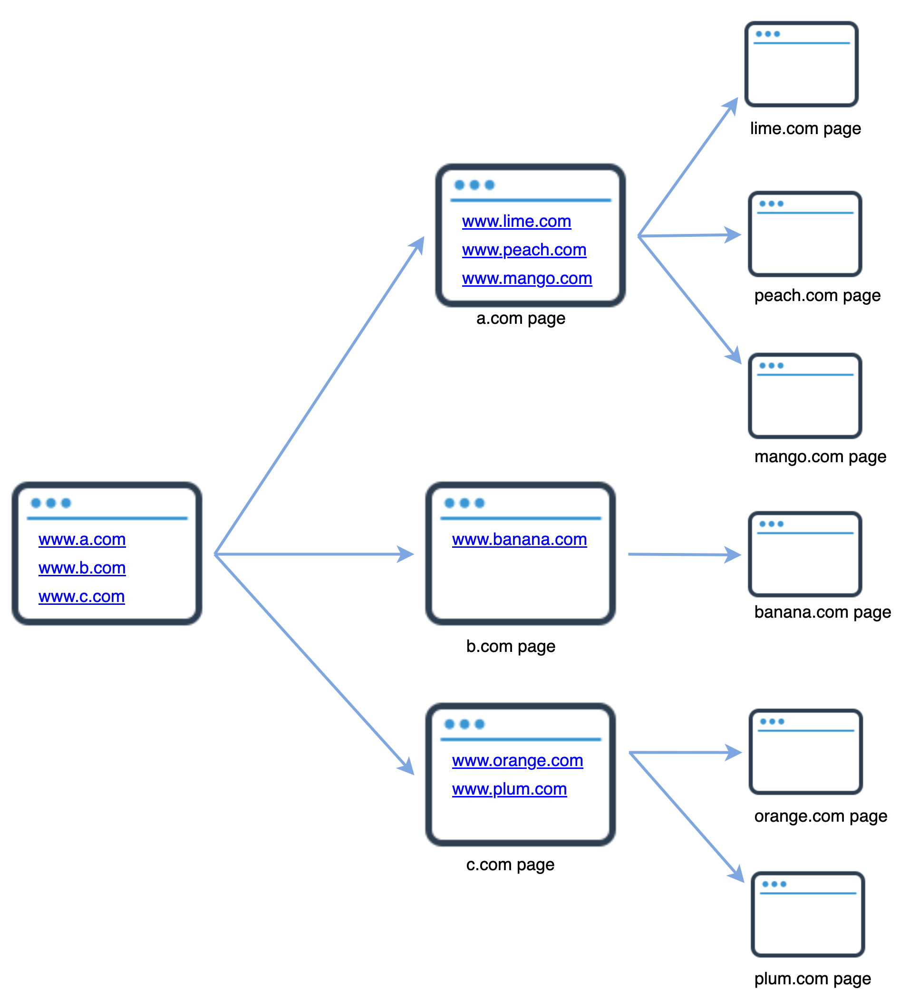

# Chapter 10: Design A Web Crawler

> Source: [ByteByteGo - System Design Interview](https://bytebytego.com/courses/system-design-interview/design-a-web-crawler)

In this chapter, we focus on web crawler design: an interesting and classic system design interview question.

A web crawler is known as a robot or spider. It is widely used by search engines to discover new or updated content on the web. Content can be a web page, an image, a video, a PDF file, etc. A web crawler starts by collecting a few web pages and then follows links on those pages to collect new content.



A crawler is used for many purposes:

- **Search engine indexing**: This is the most common use case. A crawler collects web pages to create a local index for search engines. For example, Googlebot is the web crawler behind the Google search engine.

- **Web archiving**: This is the process of collecting information from the web to preserve data for future uses. For instance, many national libraries run crawlers to archive web sites. Notable examples are the US Library of Congress and the EU web archive.

- **Web mining**: The explosive growth of the web presents an unprecedented opportunity for data mining. Web mining helps to discover useful knowledge from the internet. For example, top financial firms use crawlers to download shareholder meetings and annual reports to learn key company initiatives.

- **Web monitoring**: The crawlers help to monitor copyright and trademark infringements over the Internet. For example, Digimarc utilizes crawlers to discover pirated works and reports.

---

## Step 1 - Understand the problem and establish design scope

The basic algorithm of a web crawler is simple:

1. Given a set of URLs, download all the web pages addressed by the URLs.
2. Extract URLs from these web pages.
3. Add new URLs to the list of URLs to be downloaded. Repeat these 3 steps.

**Candidate**: What is the main purpose of the crawler? Is it used for search engine indexing, data mining, or something else?
**Interviewer**: Search engine indexing.

**Candidate**: How many web pages does the web crawler collect per month?
**Interviewer**: 1 billion pages.

**Candidate**: What content types are included? HTML only or other content types such as PDFs and images as well?
**Interviewer**: HTML only.

**Candidate**: Shall we consider newly added or edited web pages?
**Interviewer**: Yes, we should consider the newly added or edited web pages.

**Candidate**: Do we need to store HTML pages crawled from the web?
**Interviewer**: Yes, up to 5 years.

**Candidate**: How do we handle web pages with duplicate content?
**Interviewer**: Pages with duplicate content should be ignored.

Besides functionalities to clarify, it is also important to note the following characteristics of a good web crawler:

- **Scalability**: The web is very large. There are billions of web pages out there. Web crawling should be extremely efficient using parallelization.
- **Robustness**: The web is full of traps. Bad HTML, unresponsive servers, crashes, malicious links, etc. are all common. The crawler must handle all those edge cases.
- **Politeness**: The crawler should not make too many requests to a website within a short time interval.
- **Extensibility**: The system is flexible so that minimal changes are needed to support new content types.

**Back of the envelope estimation:**
- Assume 1 billion web pages are downloaded every month.
- QPS: 1,000,000,000 / 30 days / 24 hours / 3600 seconds = ~400 pages per second.
- Peak QPS = 2 * QPS = 800
- Assume the average web page size is 500k.
- 1-billion-page x 500k = 500 TB storage per month.
- Assuming data are stored for five years: 500 TB * 12 months * 5 years = 30 PB.

---

## Step 2 - Propose high-level design and get buy-in


### Seed URLs

A web crawler uses seed URLs as a starting point for the crawl process. The general strategy is to divide the entire URL space into smaller ones based on locality or topics (shopping, sports, healthcare, etc.).

### URL Frontier

Most modern web crawlers split the crawl state into two: to be downloaded and already downloaded. The component that stores URLs to be downloaded is called the **URL Frontier** — a First-in-First-out (FIFO) queue.

### HTML Downloader

The HTML downloader downloads web pages from the internet. Those URLs are provided by the URL Frontier.

### DNS Resolver

To download a web page, a URL must be translated into an IP address. For instance, URL `www.wikipedia.org` is converted to IP address `198.35.26.96`.

### Content Parser

After a web page is downloaded, it must be parsed and validated because malformed web pages could provoke problems and waste storage space. The content parser is a separate component.

### Content Seen?

Online research reveals that 29% of the web pages are duplicated contents. The "Content Seen?" data structure helps to detect new content previously stored in the system. An efficient way to accomplish this task is to compare the **hash values** of the two web pages.

### Content Storage

Both disk and memory are used:
- Most of the content is stored on disk because the data set is too big to fit in memory.
- Popular content is kept in memory to reduce latency.

### URL Extractor

URL Extractor parses and extracts links from HTML pages. Relative paths are converted to absolute URLs by adding the proper prefix.


### URL Filter

The URL filter excludes certain content types, file extensions, error links and URLs in "blacklisted" sites.

### URL Seen?

"URL Seen?" is a data structure that keeps track of URLs that are visited before or already in the Frontier. **Bloom filter** and **hash table** are common techniques to implement the "URL Seen?" component.

### URL Storage

URL Storage stores already visited URLs.

### Web crawler workflow


1. Add seed URLs to the URL Frontier
2. HTML Downloader fetches a list of URLs from URL Frontier.
3. HTML Downloader gets IP addresses of URLs from DNS resolver and starts downloading.
4. Content Parser parses HTML pages and checks if pages are malformed.
5. After content is parsed and validated, it is passed to the "Content Seen?" component.
6. "Content Seen" component checks if a HTML page is already in the storage. If not, the content is passed to Link Extractor.
7. Link extractor extracts links from HTML pages.
8. Extracted links are passed to the URL filter.
9. After links are filtered, they are passed to the "URL Seen?" component.
10. If a URL has not been processed before, it is added to the URL Frontier.

---

## Step 3 - Design deep dive

### DFS vs BFS

**DFS** is usually not a good choice because the depth of DFS can be very deep.

**BFS** is commonly used by web crawlers and is implemented by a FIFO queue. However, it has two problems:
- Most links from the same web page are linked back to the same host — overwhelming one host.
- Standard BFS does not take the priority of a URL into consideration.

### URL frontier

A URL frontier is a data structure that stores URLs to be downloaded. It ensures **politeness**, **URL prioritization**, and **freshness**.

#### Politeness

The general idea of enforcing politeness is to download one page at a time from the same host. A delay can be added between two download tasks.


- **Queue router**: Ensures that each queue only contains URLs from the same host.
- **Mapping table**: Maps each host to a queue.
- **FIFO queues b1, b2 to bn**: Each queue contains URLs from the same host.
- **Queue selector**: Each worker thread is mapped to a FIFO queue.
- **Worker threads**: Download web pages one by one from the same host.

#### Priority

We prioritize URLs based on usefulness, measured by PageRank, website traffic, update frequency, etc.


#### Freshness

Web pages are constantly being added, deleted, and edited. Strategies to optimize freshness:
- Recrawl based on web pages' update history.
- Prioritize URLs and recrawl important pages first and more frequently.

#### Storage for URL Frontier

In real-world crawl for search engines, the number of URLs in the frontier could be **hundreds of millions**. We adopted a **hybrid approach**: majority stored on disk, with in-memory buffers for enqueue/dequeue operations.

### HTML Downloader

#### Robots.txt

Robots.txt, called Robots Exclusion Protocol, is a standard used by websites to communicate with crawlers. Before attempting to crawl a web site, a crawler should check `robots.txt` first.

```
User-agent: Googlebot
Disallow: /creatorhub/*
Disallow: /rss/people/*/reviews
Disallow: /gp/pdp/rss/*/reviews
Disallow: /gp/cdp/member-reviews/
Disallow: /gp/aw/cr/
```

#### Performance optimization

1. **Distributed crawl**: Crawl jobs are distributed into multiple servers, and each server runs multiple threads.

2. **Cache DNS Resolver**: DNS response time ranges from 10ms to 200ms. Maintaining our DNS cache to avoid calling DNS frequently is an effective technique.

3. **Locality**: Distribute crawl servers geographically. When crawl servers are closer to website hosts, crawlers experience faster download time.

4. **Short timeout**: If a host does not respond within a predefined time, the crawler will stop the job.

### Robustness

- **Consistent hashing**: Helps to distribute loads among downloaders.
- **Save crawl states and data**: Crawl states and data are written to a storage system.
- **Exception handling**: Errors are inevitable and common in a large-scale system.
- **Data validation**: Important measure to prevent system errors.

### Extensibility


- PNG Downloader module is plugged-in to download PNG files.
- Web Monitor module is added to monitor the web and prevent copyright and trademark infringements.

### Detect and avoid problematic content

1. **Redundant content**: Nearly 30% of the web pages are duplicates. Hashes or checksums help to detect duplication.

2. **Spider traps**: A spider trap is a web page that causes a crawler in an infinite loop. Such spider traps can be avoided by setting a maximal length for URLs.

3. **Data noise**: Some of the contents have little or no value, such as advertisements, code snippets, spam URLs.

### Java Example – Web Crawler Core Logic

```java
import java.util.*;
import java.util.concurrent.*;

public class WebCrawler {
    private final Set<String> visitedUrls = ConcurrentHashMap.newKeySet();
    private final BlockingQueue<String> urlFrontier = new LinkedBlockingQueue<>();
    private final int maxPages;
    private int crawledCount = 0;

    public WebCrawler(List<String> seedUrls, int maxPages) {
        this.maxPages = maxPages;
        urlFrontier.addAll(seedUrls);
    }

    public void crawl() throws InterruptedException {
        while (!urlFrontier.isEmpty() && crawledCount < maxPages) {
            String url = urlFrontier.poll(1, TimeUnit.SECONDS);
            if (url == null || visitedUrls.contains(url)) continue;

            visitedUrls.add(url);
            crawledCount++;

            System.out.println("Crawling [" + crawledCount + "]: " + url);

            // Simulate downloading and extracting links
            List<String> extractedLinks = downloadAndExtract(url);
            for (String link : extractedLinks) {
                if (!visitedUrls.contains(link)) {
                    urlFrontier.offer(link);
                }
            }
        }
        System.out.println("Crawl complete. Pages visited: " + crawledCount);
    }

    private List<String> downloadAndExtract(String url) {
        // In real implementation: HTTP download + HTML parsing
        return List.of(
            url + "/page1",
            url + "/page2"
        );
    }

    public static void main(String[] args) throws InterruptedException {
        WebCrawler crawler = new WebCrawler(
            List.of("https://www.wikipedia.org", "https://www.example.com"),
            10
        );
        crawler.crawl();
    }
}
```

---

## Step 4 - Wrap up

In this chapter, we first discussed the characteristics of a good crawler: **scalability**, **politeness**, **extensibility**, and **robustness**. Then, we proposed a design and discussed key components.

Additional talking points:

- **Server-side rendering**: Numerous websites use scripts like JavaScript, AJAX, etc. to generate links on the fly. Server-side rendering (dynamic rendering) must be performed before parsing a page.

- **Filter out unwanted pages**: An anti-spam component is beneficial in filtering out low quality and spam pages.

- **Database replication and sharding**: Techniques like replication and sharding are used to improve the data layer availability, scalability, and reliability.

- **Horizontal scaling**: For large-scale crawl, hundreds or even thousands of servers are needed.

- **Availability, consistency, and reliability**: These concepts are at the core of any large system's success.

- **Analytics**: Collecting and analyzing data are important parts of any system.

---

## Reference materials

[1] US Library of Congress: https://www.loc.gov/websites/

[2] EU Web Archive: http://data.europa.eu/webarchive

[3] Digimarc: https://www.digimarc.com/products/digimarc-services/piracy-intelligence

[4] Heydon A., Najork M. Mercator: A scalable, extensible web crawler

[5] By Christopher Olston, Marc Najork: Web Crawling. http://infolab.stanford.edu/~olston/publications/crawling_survey.pdf

[6] 29% Of Sites Face Duplicate Content Issues: https://tinyurl.com/y6tmh55y

[7] L. Page, S. Brin, R. Motwani, and T. Winograd, "The PageRank citation ranking: Bringing order to the web"

[8] Google Dynamic Rendering: https://developers.google.com/search/docs/guides/dynamic-rendering
