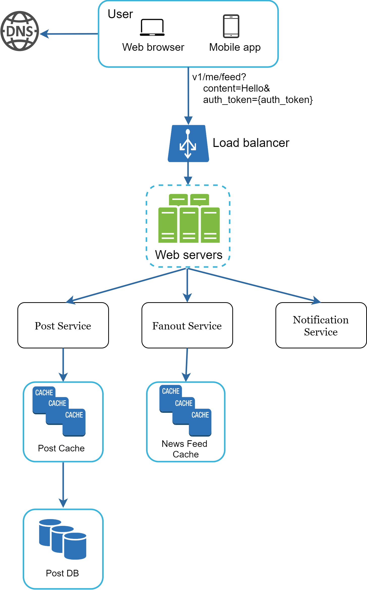
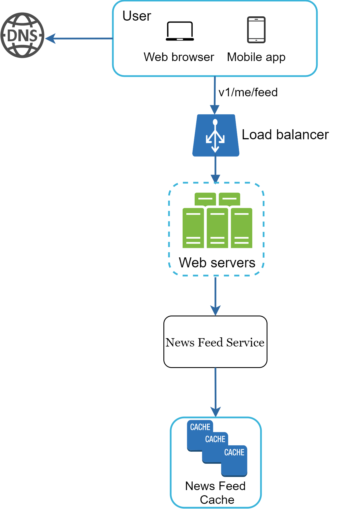
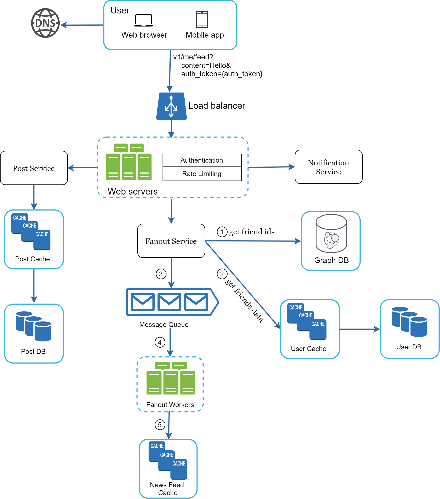
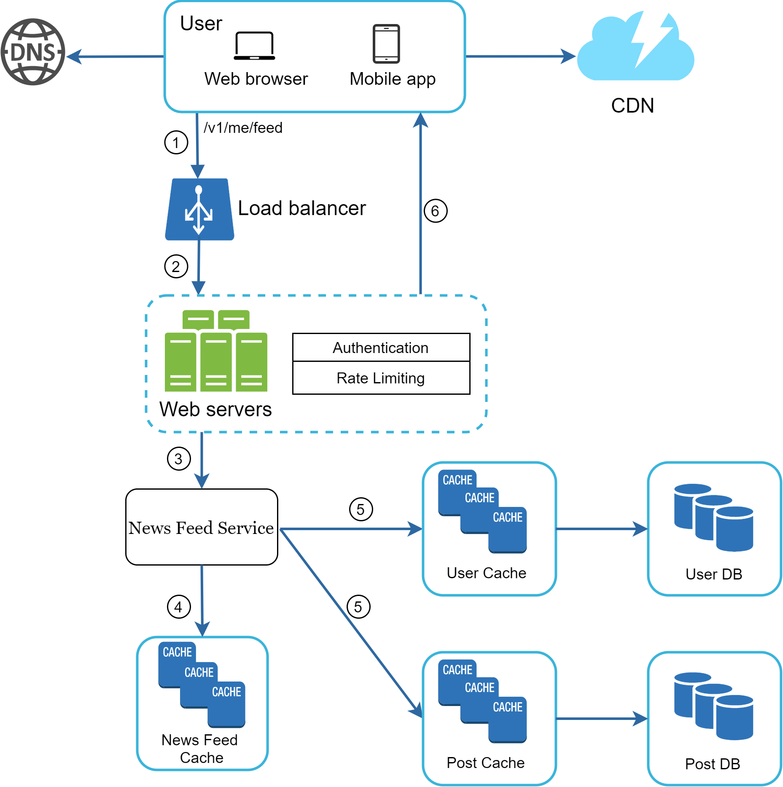

# Chapter 12: Design A News Feed System

> Source: [ByteByteGo - System Design Interview](https://bytebytego.com/courses/system-design-interview/design-a-news-feed-system)

In this chapter, you are asked to design a news feed system. According to the Facebook help page, "News feed is the constantly updating list of stories in the middle of your home page." This is a popular interview question. Similar questions: design Facebook news feed, Instagram feed, Twitter timeline, etc.


---

## Step 1 - Understand the problem and establish design scope

**Candidate**: Is this a mobile app? Or a web app? Or both?
**Interviewer**: Both

**Candidate**: What are the important features?
**Interviewer**: A user can publish a post and see her friends' posts on the news feed page.

**Candidate**: Is the news feed sorted by reverse chronological order or any particular order?
**Interviewer**: To keep things simple, let us assume the feed is sorted by reverse chronological order.

**Candidate**: How many friends can a user have?
**Interviewer**: 5000

**Candidate**: What is the traffic volume?
**Interviewer**: 10 million DAU

**Candidate**: Can feed contain images, videos, or just text?
**Interviewer**: It can contain media files, including both images and videos.

---

## Step 2 - Propose high-level design and get buy-in

The design is divided into two flows: **feed publishing** and **news feed building**.

- **Feed publishing**: when a user publishes a post, corresponding data is written into cache and database. A post is populated to her friends' news feed.
- **Newsfeed building**: the news feed is built by aggregating friends' posts in reverse chronological order.

### Newsfeed APIs

**Feed publishing API:**
```
POST /v1/me/feed
Params:
  content: content is the text of the post.
  auth_token: it is used to authenticate API requests.
```

**Newsfeed retrieval API:**
```
GET /v1/me/feed
Params:
  auth_token: it is used to authenticate API requests.
```

### Feed publishing



- **Load balancer**: distribute traffic to web servers.
- **Post service**: persist post in the database and cache.
- **Fanout service**: push new content to friends' news feed. Newsfeed data is stored in the cache for fast retrieval.
- **Notification service**: inform friends that new content is available.

### Newsfeed building



- **Newsfeed service**: fetches news feed from the cache.
- **Newsfeed cache**: stores news feed IDs needed to render the news feed.

---

## Step 3 - Design deep dive

### Feed publishing deep dive



#### Web servers

Web servers enforce **authentication** and **rate-limiting**. Only users signed in with valid auth_token are allowed to make posts.

#### Fanout service

Fanout is the process of delivering a post to all friends. Two types of fanout models:

**Fanout on write (push model):**
- ✅ Pros: News feed is generated in real-time. Fetching is fast.
- ❌ Cons: Hotkey problem for users with many friends. Waste for inactive users.

**Fanout on read (pull model):**
- ✅ Pros: No hotkey problem. No waste for inactive users.
- ❌ Cons: Fetching the news feed is slow.

**Hybrid approach**: Push model for the majority of users. For celebrities/users with many followers, let followers pull content on-demand.


The fanout service works as follows:
1. Fetch friend IDs from the graph database.
2. Get friends info from the user cache. Filter based on user settings (muted users, etc.).
3. Send friends list and new post ID to the message queue.
4. Fanout workers fetch data from the message queue and store `<post_id, user_id>` mapping in the news feed cache.
5. Store `<post_id, user_id>` in news feed cache.


### Newsfeed retrieval deep dive



Media content (images, videos, etc.) are stored in CDN for fast retrieval.

1. A user sends a request: `/v1/me/feed`
2. The load balancer redistributes requests to web servers.
3. Web servers call the news feed service.
4. News feed service gets post IDs from the news feed cache.
5. The news feed service fetches complete user and post objects from caches to construct the fully hydrated news feed.
6. The fully hydrated news feed is returned in JSON format.

### Cache architecture


| Cache Layer | Description |
|-------------|-------------|
| News Feed | Stores IDs of news feeds |
| Content | Stores every post data. Popular content in hot cache |
| Social Graph | Stores user relationship data |
| Action | Stores info about whether a user liked a post, replied, or took other actions |
| Counters | Stores counters for like, reply, follower, following, etc. |

### Java Example – News Feed Service

```java
import java.util.*;

public class NewsFeedService {

    private final Map<String, List<String>> newsFeedCache = new HashMap<>();
    private final Map<String, Post> postCache = new HashMap<>();
    private final Map<String, List<String>> friendGraph = new HashMap<>();

    record Post(String postId, String userId, String content) {}

    public void publishPost(String userId, String content) {
        String postId = UUID.randomUUID().toString();
        postCache.put(postId, new Post(postId, userId, content));

        // Fanout to friends (push model)
        List<String> friends = friendGraph.getOrDefault(userId, List.of());
        for (String friendId : friends) {
            newsFeedCache.computeIfAbsent(friendId, k -> new ArrayList<>())
                         .add(0, postId); // reverse chronological
        }
        System.out.println("Post published: " + postId + " by " + userId);
    }

    public List<Post> getNewsFeed(String userId) {
        List<String> postIds = newsFeedCache.getOrDefault(userId, List.of());
        List<Post> feed = new ArrayList<>();
        for (String postId : postIds) {
            Post post = postCache.get(postId);
            if (post != null) feed.add(post);
        }
        return feed;
    }

    public void addFriend(String userId, String friendId) {
        friendGraph.computeIfAbsent(friendId, k -> new ArrayList<>()).add(userId);
    }

    public static void main(String[] args) {
        NewsFeedService service = new NewsFeedService();
        service.addFriend("user1", "user2"); // user2 follows user1
        service.publishPost("user1", "Hello World!");
        service.publishPost("user1", "System Design is fun!");

        List<Post> feed = service.getNewsFeed("user2");
        System.out.println("\nNews Feed for user2:");
        feed.forEach(p -> System.out.println("  [" + p.postId() + "] " + p.content()));
    }
}
```

---

## Step 4 - Wrap up

In this chapter, we designed a news feed system with two flows: **feed publishing** and **news feed retrieval**.

**Scaling the database:**
- Vertical scaling vs Horizontal scaling
- SQL vs NoSQL
- Master-slave replication
- Read replicas
- Consistency models
- Database sharding

**Other talking points:**
- Keep web tier stateless
- Cache data as much as you can
- Support multiple data centers
- Loosely coupled components with message queues
- Monitor key metrics: QPS during peak hours and latency while users refreshing their news feed.

---

## Reference materials

[1] How News Feed Works: https://www.facebook.com/help/327131014036297/

[2] Friend of Friend recommendations Neo4j and SQL Server: http://geekswithblogs.net/brendonpage/archive/2015/10/26/friend-of-friend-recommendations-with-neo4j.aspx
