# Chapter 13: Design A Chat System

> Source: [ByteByteGo - System Design Interview](https://bytebytego.com/courses/system-design-interview/design-a-chat-system)

In this chapter we explore the design of a chat system. Almost everyone uses a chat app. A chat app performs different functions for different people. It is extremely important to nail down the exact requirements.

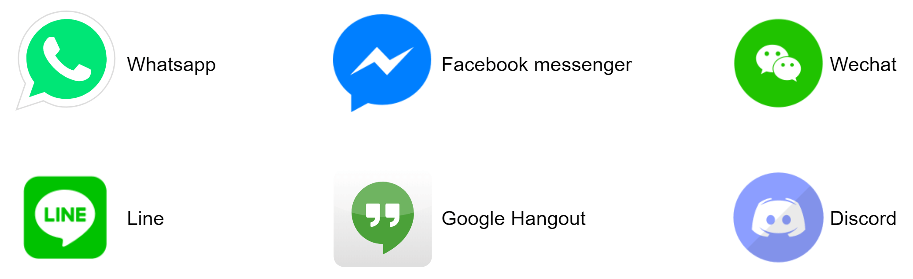

---

## Step 1 - Understand the problem and establish design scope

**Candidate**: What kind of chat app shall we design? 1 on 1 or group based?
**Interviewer**: It should support both 1 on 1 and group chat.

**Candidate**: Is this a mobile app? Or a web app? Or both?
**Interviewer**: Both.

**Candidate**: What is the scale of this app?
**Interviewer**: It should support 50 million daily active users (DAU).

**Candidate**: For group chat, what is the group member limit?
**Interviewer**: A maximum of 100 people.

**Candidate**: What features are important for the chat app? Can it support attachment?
**Interviewer**: 1 on 1 chat, group chat, online indicator. The system only supports text messages.

**Candidate**: Is there a message size limit?
**Interviewer**: Yes, text length should be less than 100,000 characters long.

**Candidate**: Is end-to-end encryption required?
**Interviewer**: Not required for now but we will discuss that if time allows.

**Candidate**: How long shall we store the chat history?
**Interviewer**: Forever.

Key features to focus on:
- A one-on-one chat with low delivery latency
- Small group chat (max of 100 people)
- Online presence
- Multiple device support
- Push notifications
- Support 50 million DAU

---

## Step 2 - Propose high-level design and get buy-in

### Communication protocols

The chat service must support:
- Receive messages from other clients.
- Find the right recipients for each message and relay the message.
- If a recipient is not online, hold the messages until she is online.

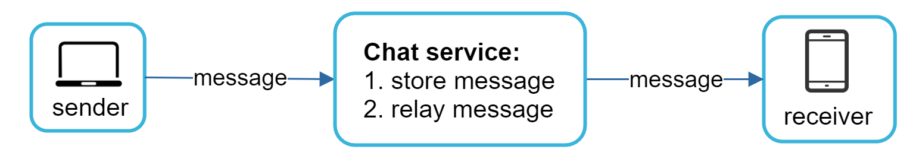

For the **sender side**, HTTP with keep-alive header is used (allows client to maintain a persistent connection and reduces TCP handshakes).

For the **receiver side**, since HTTP is client-initiated, it is not trivial to send messages from the server. Several techniques exist:

#### Polling
The client periodically asks the server if there are messages available. Could be costly.

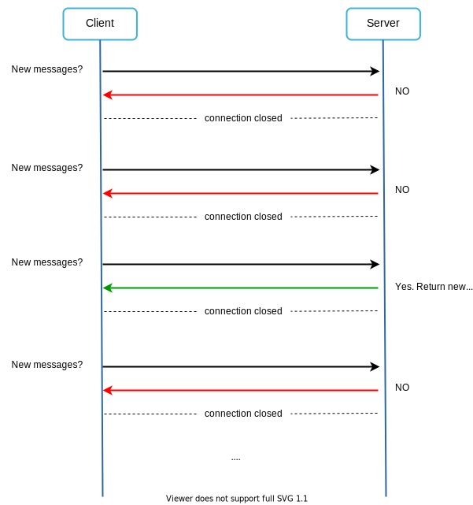

#### Long polling
The client holds the connection open until there are actually new messages available or a timeout threshold has been reached.

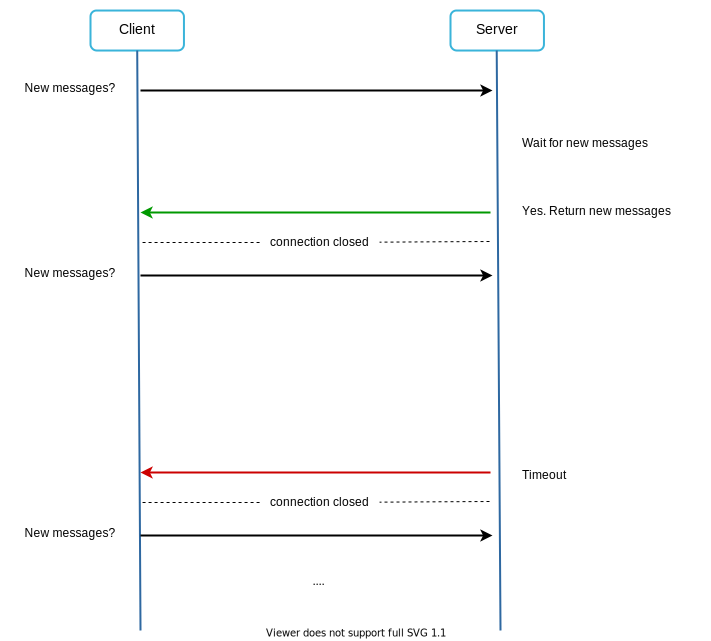

Long polling drawbacks:
- Sender and receiver may not connect to the same chat server.
- A server has no good way to tell if a client is disconnected.
- It is inefficient.

#### WebSocket

WebSocket is the most common solution for sending asynchronous updates from server to client.

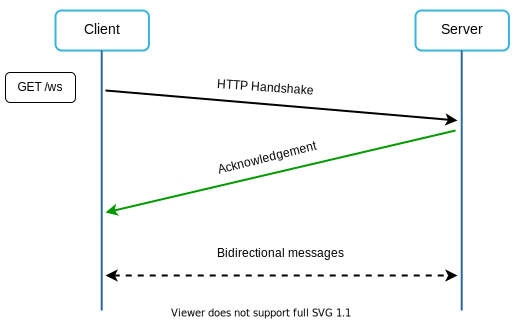

WebSocket connection is initiated by the client. It is **bi-directional** and **persistent**. It starts its life as an HTTP connection and could be "upgraded" via well-defined handshake to a WebSocket connection.

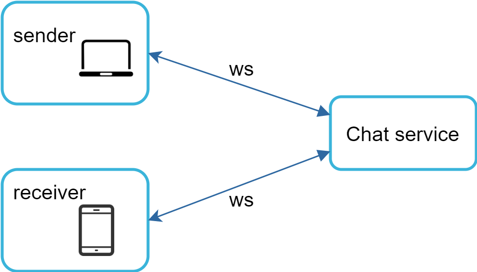

By using WebSocket for both sending and receiving, it simplifies the design and makes implementation on both client and server more straightforward.

### High-level design

The chat system is broken down into three major categories: **stateless services**, **stateful services**, and **third-party integration**.

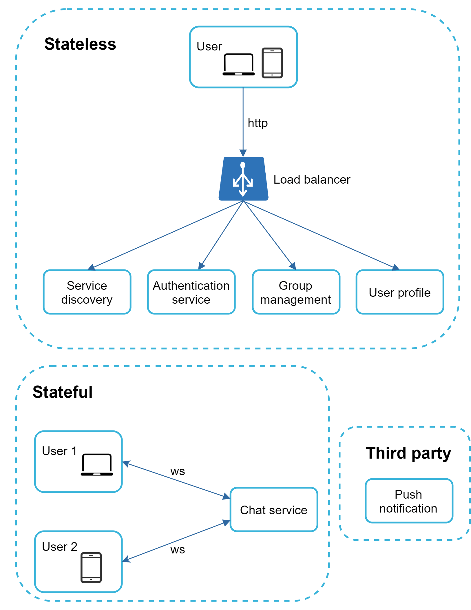

#### Stateless Services

Traditional public-facing request/response services for login, signup, user profile, etc. Sit behind a load balancer. **Service discovery** gives the client a list of DNS host names of chat servers to connect to.

#### Stateful Service

The only stateful service is the chat service. Each client maintains a **persistent network connection** to a chat server. Service discovery coordinates closely with the chat service to avoid server overloading.

#### Third-party integration

Push notification is the most important third-party integration.

#### Scalability

At 1M concurrent users, assuming each connection needs 10K of memory, it only needs about 10GB of memory to hold all connections — but single server design is a deal breaker due to SPOF.

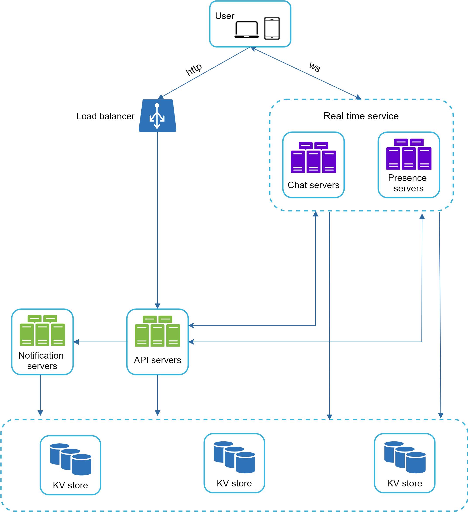

### Storage

Two types of data:
1. **Generic data** (user profile, settings, friends list) → relational databases with replication and sharding.
2. **Chat history data** → Key-value stores.

Why key-value stores for chat history?
- Easy horizontal scaling.
- Very low latency to access data.
- Relational databases don't handle long tail of data well (expensive random access with large indexes).
- **Facebook Messenger** uses HBase; **Discord** uses Cassandra.

### Data models

#### Message table for 1 on 1 chat

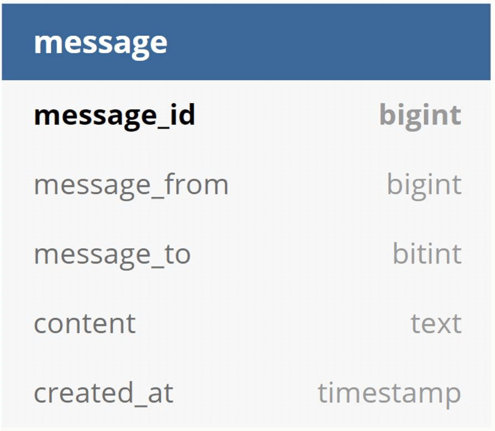

Primary key is `message_id` (helps decide message sequence). Cannot rely on `created_at` as two messages can be created at the same time.

#### Message table for group chat

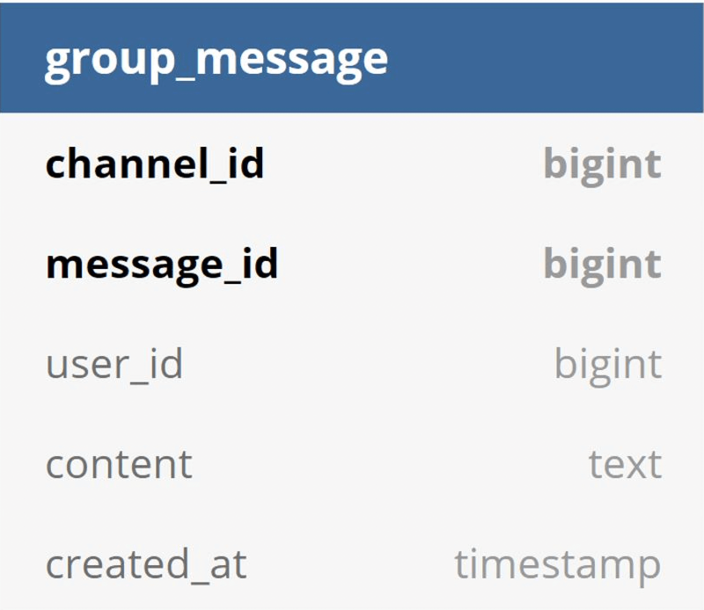

Composite primary key is `(channel_id, message_id)`. `channel_id` is the partition key.

#### Message ID

Message_id must satisfy:
- IDs must be unique.
- IDs should be sortable by time (new rows have higher IDs).

Options:
- **MySQL auto_increment** — NoSQL databases usually don't provide this.
- **Global 64-bit sequence number generator like Snowflake** — discussed in "Design a unique ID generator" chapter.
- **Local sequence number generator** — IDs unique within a group.

---

## Step 3 - Design deep dive

### Service discovery

The primary role is to recommend the best chat server for a client based on geographical location, server capacity, etc. **Apache Zookeeper** registers all available chat servers.

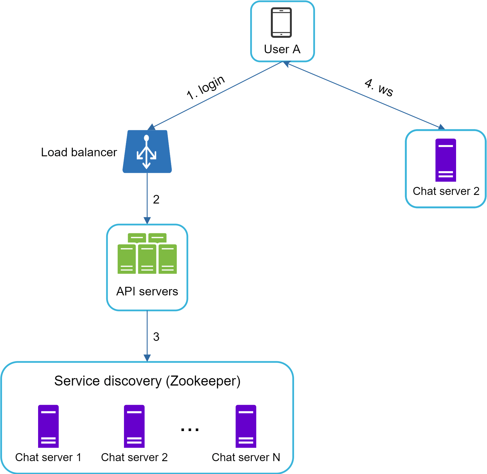

1. User A tries to log in to the app.
2. The load balancer sends the login request to API servers.
3. After authentication, service discovery finds the best chat server. Server 2 is chosen and returned to User A.
4. User A connects to chat server 2 through WebSocket.

### Message flows

#### 1 on 1 chat flow

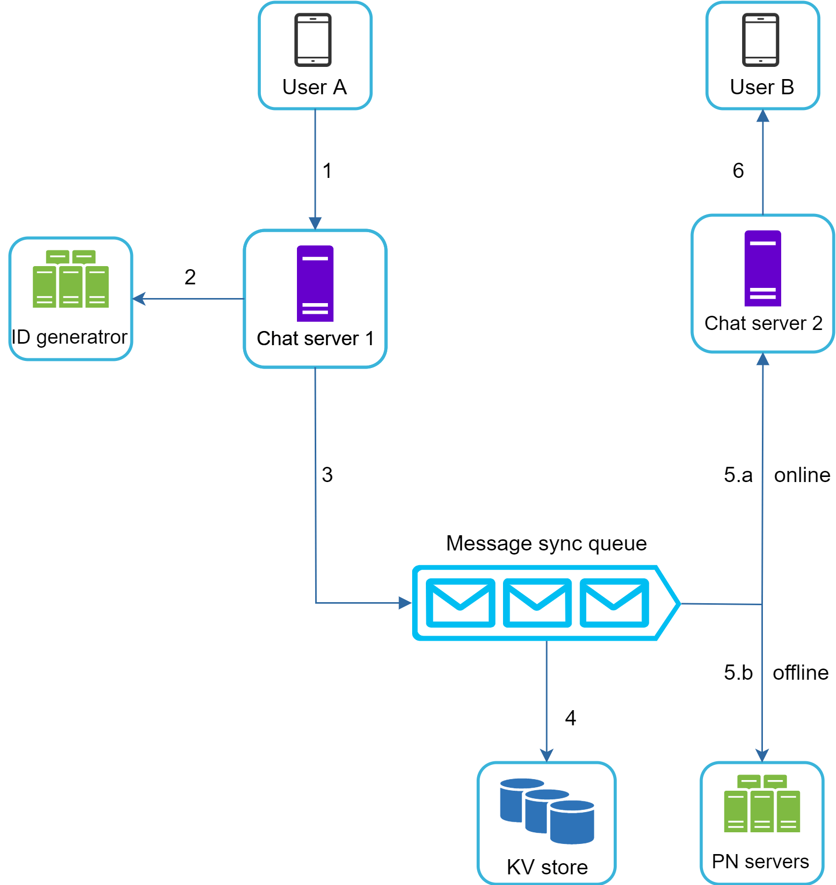

1. User A sends a chat message to Chat server 1.
2. Chat server 1 obtains a message ID from the ID generator.
3. Chat server 1 sends the message to the message sync queue.
4. The message is stored in a key-value store.
5a. If User B is online, the message is forwarded to Chat server 2.
5b. If User B is offline, a push notification is sent from push notification servers.
6. Chat server 2 forwards the message to User B via persistent WebSocket connection.

#### Message synchronization across multiple devices

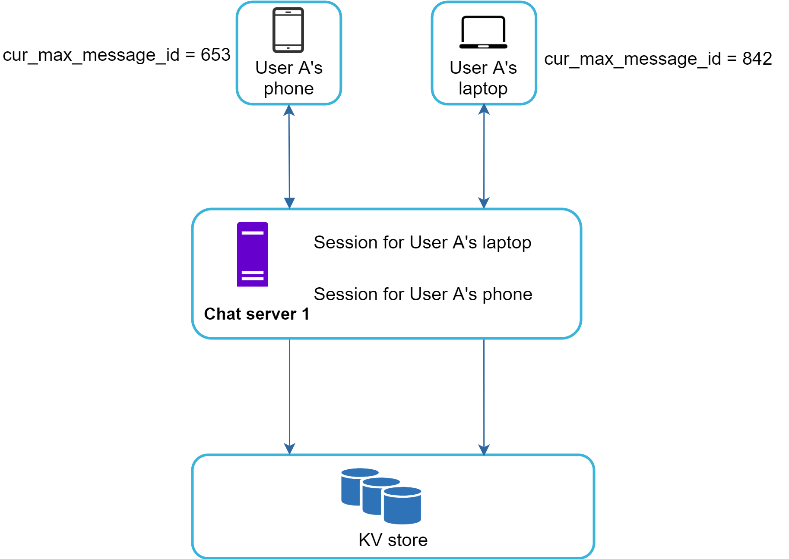

Each device maintains a variable `cur_max_message_id`. Messages are new if:
- The recipient ID equals the currently logged-in user ID.
- Message ID in the key-value store is larger than `cur_max_message_id`.

#### Small group chat flow

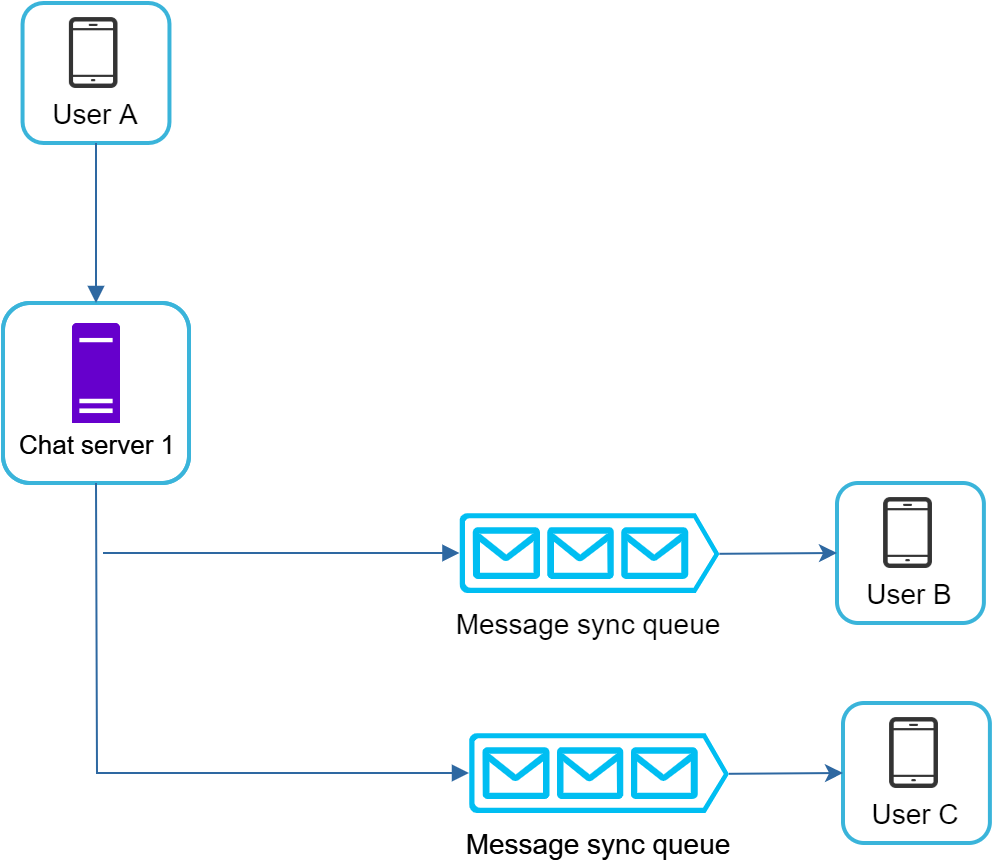

When User A sends a message in a group chat, the message from User A is **copied to each group member's message sync queue** (inbox). This design is good for small group chat because:
- Simplifies message sync flow as each client only needs to check its own inbox.
- When the group number is small, storing a copy in each recipient's inbox is not too expensive.
- WeChat uses a similar approach and limits a group to 500 members.

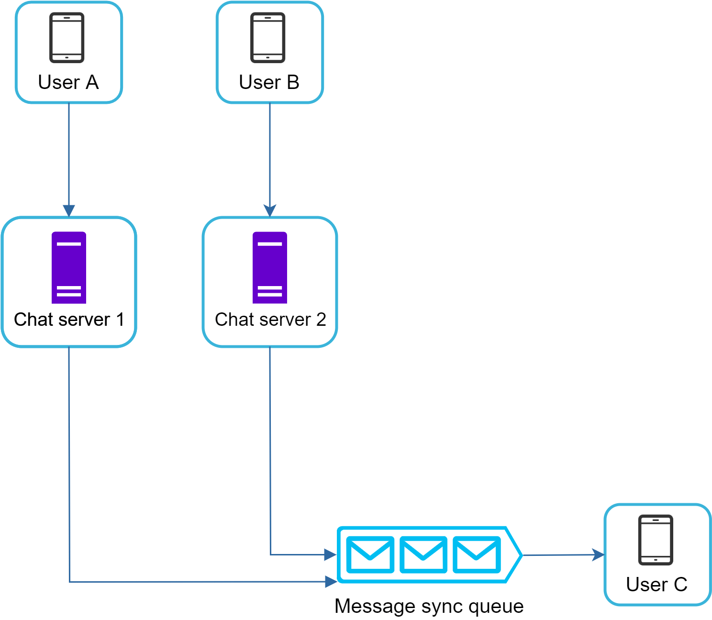

### Online presence

Presence servers are responsible for managing online status and communicating with clients through WebSocket.

#### User login
After a WebSocket connection is built, user A's online status and `last_active_at` timestamp are saved in the KV store.

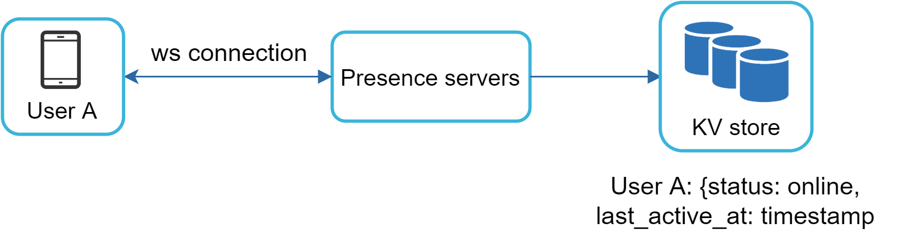

#### User logout
The online status is changed to offline in the KV store.

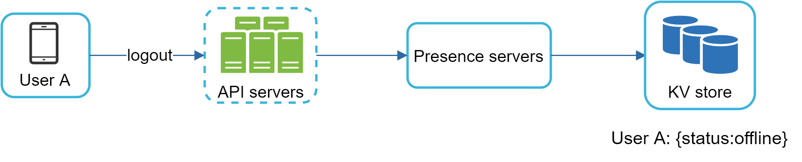

#### User disconnection (Heartbeat mechanism)

A naive approach (marking user offline on every disconnect) would make the presence indicator change too often. We introduce a **heartbeat mechanism**: the client sends a heartbeat event to presence servers every 5 seconds. If presence servers receive a heartbeat within x seconds, the user is considered online.

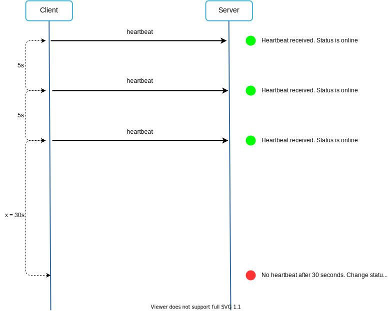

#### Online status fanout

Presence servers use a **publish-subscribe model**: each friend pair maintains a channel. When User A's online status changes, it publishes to channels A-B, A-C, A-D. Those channels are subscribed by Users B, C, D respectively.

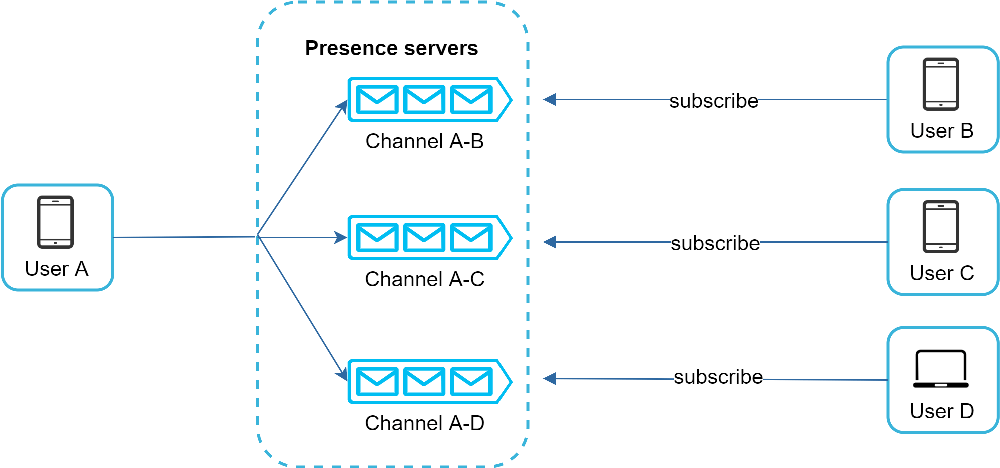

For large groups (100,000 members), fetching online status only when a user enters a group or manually refreshes the friend list is preferred.

### Java Example – WebSocket Chat Server

```java
import java.util.*;
import java.util.concurrent.*;

public class ChatServer {

    // Map: userId -> WebSocket session (simulated with BlockingQueue)
    private final Map<String, BlockingQueue<String>> sessions = new ConcurrentHashMap<>();
    // Map: userId -> online status
    private final Map<String, Boolean> presenceStore = new ConcurrentHashMap<>();

    public void connect(String userId) {
        sessions.put(userId, new LinkedBlockingQueue<>());
        presenceStore.put(userId, true);
        System.out.println(userId + " connected. Status: ONLINE");
    }

    public void disconnect(String userId) {
        sessions.remove(userId);
        presenceStore.put(userId, false);
        System.out.println(userId + " disconnected. Status: OFFLINE");
    }

    public void sendMessage(String fromId, String toId, String content) {
        String messageId = UUID.randomUUID().toString().substring(0, 8);
        String message = "[" + messageId + "] " + fromId + " → " + toId + ": " + content;

        BlockingQueue<String> toSession = sessions.get(toId);
        if (toSession != null) {
            toSession.offer(message); // Deliver via WebSocket
            System.out.println("Delivered: " + message);
        } else {
            System.out.println("User " + toId + " offline. Sending push notification...");
        }
    }

    public void receiveMessages(String userId) throws InterruptedException {
        BlockingQueue<String> session = sessions.get(userId);
        if (session == null) return;

        System.out.println("\nMessages for " + userId + ":");
        while (!session.isEmpty()) {
            System.out.println("  " + session.poll());
        }
    }

    public boolean isOnline(String userId) {
        return presenceStore.getOrDefault(userId, false);
    }

    public static void main(String[] args) throws InterruptedException {
        ChatServer server = new ChatServer();

        server.connect("Alice");
        server.connect("Bob");

        server.sendMessage("Alice", "Bob", "Hey Bob, how are you?");
        server.sendMessage("Alice", "Bob", "Are you there?");

        server.receiveMessages("Bob");

        server.disconnect("Bob");
        server.sendMessage("Alice", "Bob", "Bob?"); // triggers push notification

        System.out.println("\nAlice online: " + server.isOnline("Alice"));
        System.out.println("Bob online: " + server.isOnline("Bob"));
    }
}
```

---

## Step 4 - Wrap up

In this chapter, we presented a chat system architecture that supports both 1-to-1 chat and small group chat. **WebSocket** is used for real-time communication. The chat system contains:
- Chat servers for real-time messaging
- Presence servers for managing online presence
- Push notification servers
- Key-value stores for chat history persistence
- API servers for other functionalities

Additional talking points:

- **Media files support**: Compression, cloud storage, and thumbnails are interesting topics.
- **End-to-end encryption**: Only the sender and the recipient can read messages.
- **Caching messages on the client-side**: Effective to reduce the data transfer.
- **Improve load time**: Slack built a geographically distributed network to cache users' data.
- **Error handling**:
  - Chat server error: Service discovery (Zookeeper) will provide a new chat server.
  - Message resent mechanism: Retry and queueing are common techniques.

---

## Reference materials

[1] Erlang at Facebook: https://www.erlang-factory.com/upload/presentations/31/EugeneLetuchy-ErlangatFacebook.pdf

[2] Messenger and WhatsApp process 60 billion messages a day: https://www.theverge.com/2016/4/12/11415198/facebook-messenger-whatsapp-number-messages-vs-sms-f8-2016

[3] Long tail: https://en.wikipedia.org/wiki/Long_tail

[4] The Underlying Technology of Messages: https://www.facebook.com/notes/facebook-engineering/the-underlying-technology-of-messages/454991608919/

[5] How Discord Stores Billions of Messages: https://discord.com/blog/how-discord-stores-billions-of-messages

[6] Announcing Snowflake: https://blog.twitter.com/engineering/en_us/a/2010/announcing-snowflake.html

[7] Apache ZooKeeper: https://zookeeper.apache.org/

[8] End-to-end encryption: https://faq.whatsapp.com/en/android/28030015/

[9] Flannel: An Application-Level Edge Cache to Make Slack Scale: https://slack.engineering/flannel-an-application-level-edge-cache-to-make-slack-scale-b8a6400e2f6b
