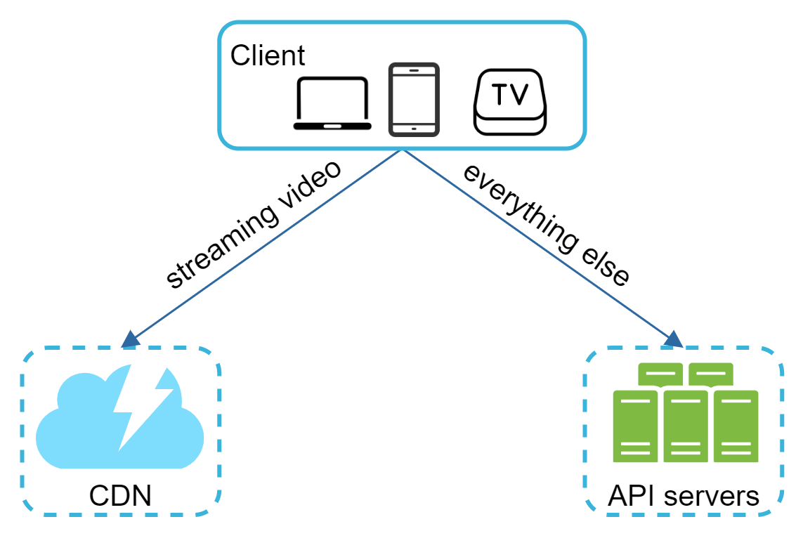
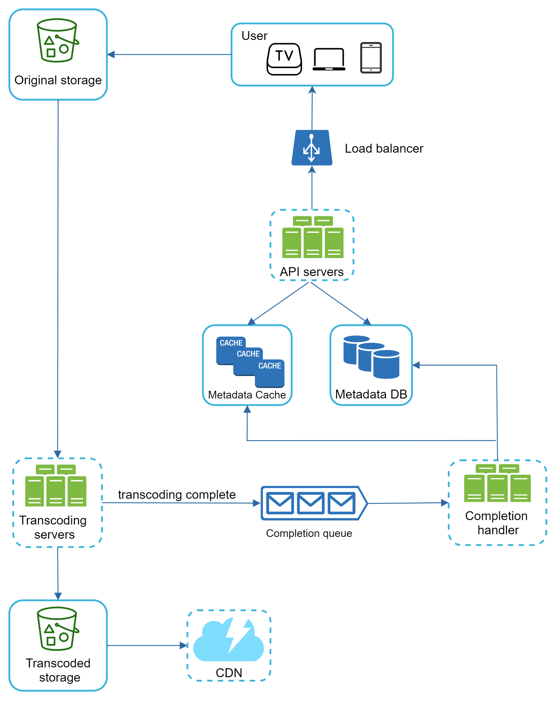
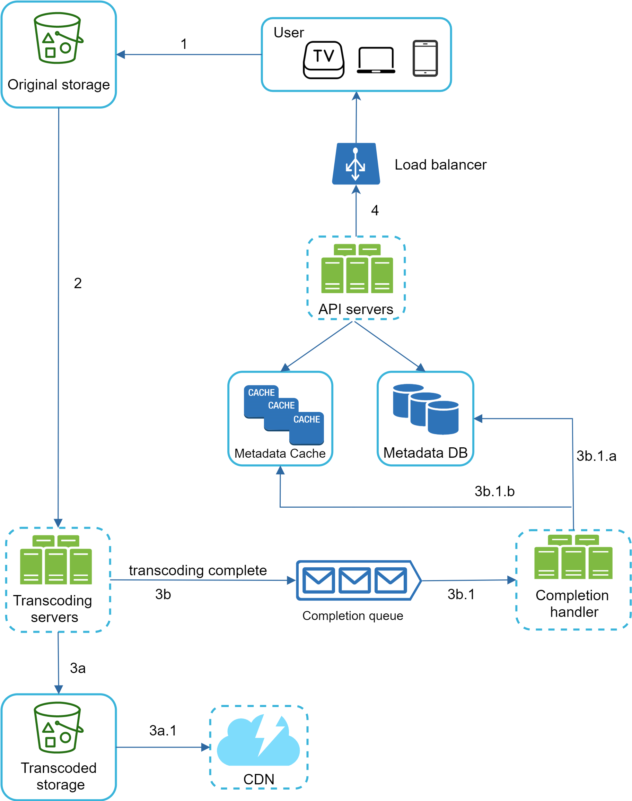

# Chapter 15: Design YouTube

> Source: [ByteByteGo - System Design Interview](https://bytebytego.com/courses/system-design-interview/design-youtube)

In this chapter, you are asked to design YouTube. The solution to this question can be applied to other interview questions like designing a video sharing platform such as Netflix and Hulu.

**YouTube Statistics (2020):**
- Total number of monthly active users: 2 billion
- Number of videos watched per day: 5 billion
- 73% of US adults use YouTube
- 50 million creators on YouTube
- YouTube's Ad revenue was $15.1 billion for the full year 2019
- YouTube is responsible for 37% of all mobile internet traffic
- Available in 80 different languages

---

## Step 1 - Understand the problem and establish design scope

**Candidate**: What features are important?
**Interviewer**: Ability to upload a video and watch a video.

**Candidate**: What clients do we need to support?
**Interviewer**: Mobile apps, web browsers, and smart TV.

**Candidate**: How many daily active users do we have?
**Interviewer**: 5 million

**Candidate**: What is the average daily time spent on the product?
**Interviewer**: 30 minutes.

**Candidate**: Do we need to support international users?
**Interviewer**: Yes, a large percentage of users are international users.

**Candidate**: What are the supported video resolutions?
**Interviewer**: The system accepts most of the video resolutions and formats.

**Candidate**: Is encryption required?
**Interviewer**: Yes

**Candidate**: Any file size requirement for videos?
**Interviewer**: Our platform focuses on small and medium-sized videos. The maximum allowed video size is 1GB.

**Candidate**: Can we leverage existing cloud infrastructures?
**Interviewer**: Yes, recommended to leverage existing cloud services.

**Focus features:**
- Ability to upload videos fast
- Smooth video streaming
- Ability to change video quality
- Low infrastructure cost
- High availability, scalability, and reliability

**Back of the envelope estimation:**
- 5 million DAU, watch 5 videos per day
- 10% of users upload 1 video per day. Average video size is 300 MB.
- Total daily storage: 5M * 10% * 300MB = 150TB
- CDN cost: 5M * 5 videos * 0.3GB * $0.02 = $150,000/day

---

## Step 2 - Propose high-level design and get buy-in

Instead of building everything from scratch, leverage existing cloud services (CDN and blob storage). Even Netflix leverages Amazon's cloud services, and Facebook uses Akamai's CDN.

At the high-level, the system comprises three components:



- **Client**: Watch YouTube on computer, mobile phone, and smartTV.
- **CDN**: Videos are stored in CDN. When you press play, a video is streamed from the CDN.
- **API servers**: Everything else except video streaming — feed recommendation, generating video upload URL, updating metadata database and cache, user signup, etc.

Two key flows:
1. **Video uploading flow**
2. **Video streaming flow**

### Video uploading flow



Components:
- **Load balancer**: Evenly distributes requests among API servers.
- **Metadata DB**: Sharded and replicated for performance and HA.
- **Metadata cache**: Video metadata and user objects cached.
- **Original storage**: Blob storage (BLOB = Binary Large Object) for original videos.
- **Transcoding servers**: Convert video format (MPEG, HLS, etc.) for different devices and bandwidths.
- **Transcoded storage**: Blob storage for transcoded video files.
- **CDN**: Videos cached in CDN.
- **Completion queue**: Message queue storing video transcoding completion events.
- **Completion handler**: Workers that pull from completion queue and update metadata.

**Flow a: upload the actual video**



1. Videos are uploaded to the original storage.
2. Transcoding servers fetch videos and start transcoding.
3. Once transcoding is complete:
   - 3a. Transcoded videos are sent to transcoded storage → distributed to CDN.
   - 3b. Transcoding completion events queued → completion handler updates metadata DB and cache.
4. API servers inform the client that the video is successfully uploaded.

**Flow b: update the metadata**
While uploading, the client in parallel sends a request to update video metadata (file name, size, format, etc.).

### Video streaming flow

Streaming means your device continuously receives video streams. Popular streaming protocols:
- MPEG-DASH (Dynamic Adaptive Streaming over HTTP)
- Apple HLS (HTTP Live Streaming)
- Microsoft Smooth Streaming
- Adobe HTTP Dynamic Streaming (HDS)

Videos are streamed from CDN directly. The edge server closest to you delivers the video with very little latency.

---

## Step 3 - Design deep dive

### Video transcoding

Video transcoding is important because:
- Raw video consumes large amounts of storage space.
- Many devices only support certain video formats.
- Users should get higher resolution on high bandwidth and lower on low bandwidth.
- Network conditions change, especially on mobile.

Two parts of encoding formats:
- **Container**: Basket that contains the video file, audio, and metadata (.avi, .mov, .mp4).
- **Codecs**: Compression/decompression algorithms (H.264, VP9, HEVC).

### Directed acyclic graph (DAG) model

To support different video processing pipelines and maintain high parallelism, we use a DAG programming model (inspired by Facebook's streaming video engine).


Tasks on a video file:
- **Inspection**: Ensure videos are of good quality.
- **Video encodings**: Convert to different resolutions, codec, bitrates.
- **Thumbnail**: Uploaded by user or auto-generated.
- **Watermark**: Image overlay with identifying information.

### Video transcoding architecture


Six main components: preprocessor, DAG scheduler, resource manager, task workers, temporary storage, and encoded video.

**Preprocessor:**
1. Video splitting (GOP alignment — Group of Pictures).
2. DAG generation from configuration files.
3. Cache data in temporary storage for retry operations.

**DAG scheduler:**
Splits a DAG graph into stages of tasks and puts them in the task queue.

**Resource manager:**
- Task queue (priority queue)
- Worker queue (priority queue with worker utilization info)
- Running queue (info about currently running tasks and workers)
- Task scheduler

**Task workers:**
Run the tasks defined in the DAG (encoding, thumbnail, watermarking, etc.).

**Temporary storage:**
Metadata cached in memory. Video/audio in blob storage. Data freed once processing completes.

### System optimizations

**Speed optimization: parallelize video uploading**

Split video into smaller chunks by GOP alignment. Allows fast resumable uploads when previous upload failed.

**Speed optimization: place upload centers close to users**

Set up multiple upload centers across the globe. CDN serves as upload centers.

**Speed optimization: parallelism everywhere**

Introduce message queues to make the system loosely coupled. The encoding module does not need to wait for the output of the download module.

**Safety optimization: pre-signed upload URL**

Client makes HTTP request to API servers to fetch pre-signed URL. Then uploads video directly using the pre-signed URL (Amazon S3, Azure Shared Access Signature).

**Safety optimization: protect your videos**

- DRM systems: Apple FairPlay, Google Widevine, Microsoft PlayReady
- AES encryption
- Visual watermarking

**Cost-saving optimization:**

YouTube video streams follow long-tail distribution — a few popular videos accessed frequently, many others with few viewers.

1. Only serve the most popular videos from CDN; others from high-capacity storage servers.
2. For less popular content, encode on-demand instead of storing multiple versions.
3. Videos popular only in certain regions don't need to be distributed globally.
4. Build your own CDN like Netflix or partner with ISPs.

### Error handling

Types of errors:
- **Recoverable error**: Retry the operation (e.g., video segment fails to transcode).
- **Non-recoverable error**: Stop running tasks and return proper error code (e.g., malformed video format).

Error playbook:
- Upload error: retry a few times.
- Split video error: pass entire video to server-side splitting.
- Transcoding error: retry.
- Preprocessor error: regenerate DAG diagram.
- DAG scheduler error: reschedule a task.
- Resource manager queue down: use a replica.
- Task worker down: retry on new worker.
- API server down: redirect to different stateless server.
- Metadata cache server down: fetch from other replicas.
- Metadata DB Master down: promote slave to master.
- Slave down: use another slave, bring up replacement.

### Java Example – Video Upload Service

```java
import java.util.*;
import java.util.concurrent.*;

public class VideoUploadService {

    enum Status { PENDING, UPLOADING, TRANSCODING, READY, FAILED }

    record VideoMetadata(String videoId, String filename, long sizeBytes, Status status) {}

    private final Map<String, VideoMetadata> metadataDB = new ConcurrentHashMap<>();
    private final BlockingQueue<String> transcodingQueue = new LinkedBlockingQueue<>();

    public String initiateUpload(String filename, long sizeBytes) {
        String videoId = UUID.randomUUID().toString().substring(0, 8);
        metadataDB.put(videoId, new VideoMetadata(videoId, filename, sizeBytes, Status.PENDING));
        System.out.println("Upload initiated for: " + filename + " [ID: " + videoId + "]");
        return videoId;
    }

    public void completeUpload(String videoId) {
        VideoMetadata meta = metadataDB.get(videoId);
        if (meta == null) throw new IllegalArgumentException("Video not found: " + videoId);
        metadataDB.put(videoId, new VideoMetadata(videoId, meta.filename(), meta.sizeBytes(), Status.TRANSCODING));
        transcodingQueue.offer(videoId);
        System.out.println("Upload complete, queued for transcoding: " + videoId);
    }

    public void processTranscoding() throws InterruptedException {
        while (!transcodingQueue.isEmpty()) {
            String videoId = transcodingQueue.poll(1, TimeUnit.SECONDS);
            if (videoId == null) continue;
            System.out.println("Transcoding video: " + videoId);
            Thread.sleep(500); // simulate transcoding
            VideoMetadata meta = metadataDB.get(videoId);
            metadataDB.put(videoId, new VideoMetadata(videoId, meta.filename(), meta.sizeBytes(), Status.READY));
            System.out.println("Transcoding complete. Video ready: " + videoId);
        }
    }

    public Status getStatus(String videoId) {
        VideoMetadata meta = metadataDB.get(videoId);
        return meta != null ? meta.status() : null;
    }

    public static void main(String[] args) throws InterruptedException {
        VideoUploadService service = new VideoUploadService();
        String id1 = service.initiateUpload("travel_vlog.mp4", 500_000_000L);
        String id2 = service.initiateUpload("tutorial.mp4", 200_000_000L);
        service.completeUpload(id1);
        service.completeUpload(id2);
        service.processTranscoding();
        System.out.println("Status of " + id1 + ": " + service.getStatus(id1));
    }
}
```

---

## Step 4 - Wrap up

Additional points:
- **Scale the API tier**: Stateless servers, easy to scale horizontally.
- **Scale the database**: Database replication and sharding.
- **Live streaming**: Higher latency requirement, different error handling, lower parallelism requirement.
- **Video takedowns**: Videos violating copyrights, pornography, or illegal acts can be removed.

---

## Reference materials

[1] YouTube by the numbers: https://www.omnicoreagency.com/youtube-statistics/

[2] Cloudfront Pricing: https://aws.amazon.com/cloudfront/pricing/

[3] Netflix on AWS: https://aws.amazon.com/solutions/case-studies/netflix/

[4] SVE: Distributed Video Processing at Facebook Scale: https://www.cs.princeton.edu/~wlloyd/papers/sve-sosp17.pdf

[5] YouTube scalability talk: https://www.youtube.com/watch?v=w5WVu624fY8

[6] Content Popularity for Open Connect: https://netflixtechblog.com/content-popularity-for-open-connect-b86d56f613b
